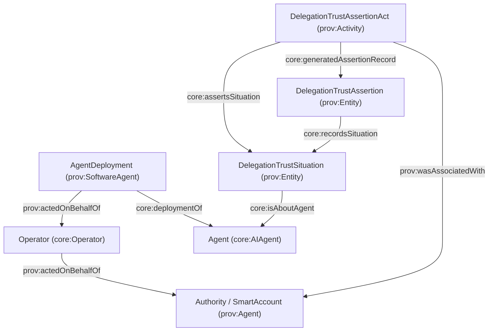
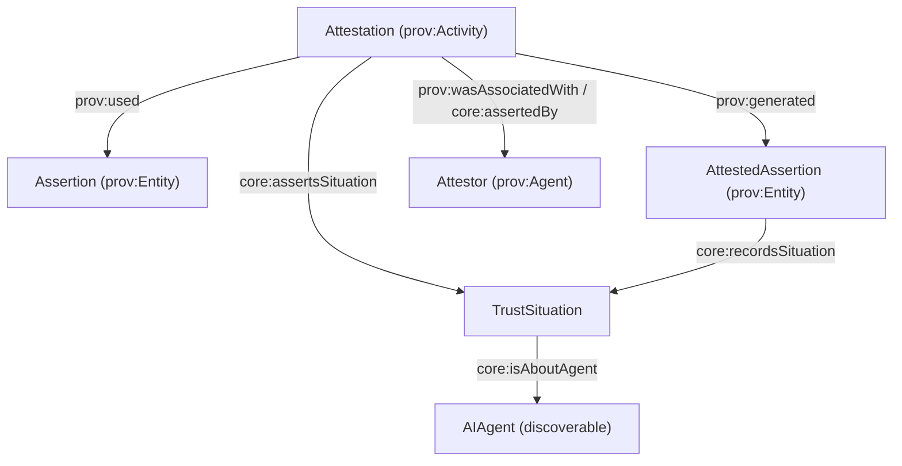

# OpenID Connect for Agents (OIDC-A) and AgenticTrust ontology mapping

## What is OIDC-A?

**OpenID Connect for Agents (OIDC-A)** is a proposal to extend OpenID Connect (OIDC) so that **LLM-based agents** can be represented, authenticated, and authorized using familiar OAuth2/OIDC machinery. It emphasizes:

- **Agent identity claims** (type, model, provider, instance identity)
- **Delegation chains** (who delegated what authority to whom, and why)
- **Attestation** (evidence about integrity/origin; e.g., TEE quotes, zk proofs)
- **Capability-based authorization** (fine-grained permissions based on agent attributes)

## How AgenticTrust splits “agent” concepts (discoverable vs executor)

AgenticTrust separates **what you discover and build a trust graph around** from **what actually executes at endpoints**, and also separates **authority** from **operators**:

- **Discoverable agent (trust-graph anchor)**: `core:AIAgent`
- **Canonical authority (e.g., smart account)**: typically modeled as an account/agent (often `eth:Account` in `apps/ontology/ontology/eth.ttl`, or generically `prov:Agent`) and surfaced via `agentAccount` identifiers/endpoints
- **Operator (delegated actor)**: `core:Operator` ⊑ `prov:Agent` (listed on protocol descriptors; can be linked via delegation relationships)
- **Executable at endpoint**: `core:AgentDeployment` ⊑ `prov:SoftwareAgent`, linked to the discoverable agent via `core:deploymentOf`

When you want explicit delegation:

- `prov:actedOnBehalfOf` (delegatee → delegator)
- `core:delegatedBy` (delegator → delegatee, inverse convenience)

See also: [`agent-application.md`](./agent-application.md).

## Agent identity is registry-scoped

OIDC-A identity claims often refer to an identity anchored in some authority. AgenticTrust models **AgentIdentity as a prov:Entity in the context of registries**, and links it to the Agent via:

- `core:hasIdentity` (Agent → AgentIdentity)
- `core:identityRegistry` (AgentIdentity → AgentRegistry)

See also: [`agent-identity.md`](./agent-identity.md).

## Primary references (links)

- **OIDC-A proposal (GitHub)**: `https://github.com/subramanya1997/oidc-a`
- **arXiv paper**: `https://arxiv.org/pdf/2509.25974`
- **OpenID Foundation paper**: `https://openid.net/wp-content/uploads/2025/10/Identity-Management-for-Agentic-AI.pdf`

## Vocabulary comparison: OIDC-A vs AgenticTrust

OIDC-A is a **protocol + claim vocabulary**; AgenticTrust is a **knowledge/ontology model** meant to represent agents, identities, descriptors, and trust evidence (verification, reputation, relationships) as a graph.

### Quick mapping table (suggested)

| OIDC-A concept / claim | Meaning | AgenticTrust representation (today) | Suggested alignment |
|---|---|---|---|
| `agent_type` | class/category of agent | `core:AIAgent` + optional tags | Use `core:hasAgentTypeTag` (Agent → Tag) and/or descriptor taxonomy (`core:metadataAgentCategory`) |
| `agent_model` | base model family | Supported at descriptor-level and entity-level | Use `core:modelId` (AgentDescriptor) and/or `core:AgentModel` (prov:Entity) + `core:usesModel` (AgentDeployment → AgentModel) |
| `agent_version` | model/app version identifier | Supported at descriptor-level and deployment-level | Use `core:modelVersion` (AgentDescriptor) and/or `core:deploymentVersion` (AgentDeployment) |
| `agent_provider` | org that provides/hosts the executable | `core:Organization` / `core:AIAgentProvider` | Use `core:agentProvider` (AgentDeployment → Organization) and/or `core:agentProviderValue` (AgentDescriptor string) |
| `agent_instance_id` / instance | runtime / session identity | Prefer modeling as Activities | Map to `core:SkillInvocation` / `core:TaskExecution` identifiers (or store in `core:json` on those activities) rather than creating a new SoftwareAgent identity per session |
| `agent_authority` / `agent_account` | canonical signing authority (often a smart account) | Account identifiers exist in chain-specific ontologies | Represent the authority as an account agent (e.g., `eth:Account`) and link it via identifiers/endpoints (e.g., `agentAccount` endpoint type) and/or identity controller properties (`core:identifierController`) |
| `operator` / `operator_sub` | delegated operator identity | Operator is a `prov:Agent` | Represent as `core:Operator` and attach to protocol descriptors via `core:hasOperator` (and model delegation with `prov:actedOnBehalfOf`) |
| `agent_capabilities` | declared capabilities | Protocol-first: skills/domains mostly live on protocol descriptor; also OASF | Treat capabilities as **skills** (OASF ids) on protocol descriptors; define a mapping layer from capability ids → OASF skill ids |
| `agent_attestation` | integrity evidence / attestation token | Attestation/AttestedAssertion pattern exists | Model the accountable act as `core:Attestation` (prov:Activity) with the attestor via `prov:wasAssociatedWith`/`core:assertedBy`, producing an `core:AttestedAssertion` (prov:Entity). (Optionally link evidence objects.) See [`attested-assertion.md`](./attested-assertion.md). |
| `attestation_formats_supported` | supported attestation formats | Not a first-class field | Add to protocol descriptor metadata (`core:attestationFormatValue`), or a controlled-vocab node list |
| `delegator_sub` | delegator identity | AgenticTrust can model accounts/identifiers; assertions already use `core:assertedBy` patterns | Model delegator as a `prov:Agent` (Account or Person). Link delegation act via `prov:wasAssociatedWith` + `prov:actedOnBehalfOf` |
| `delegation_chain[]` | chain of delegation steps | Delegation trust classes exist | Use `core:DelegationTrustSituation` + `core:DelegationTrustAssertionAct` + `core:DelegationTrustAssertion`, plus `prov:actedOnBehalfOf` (delegatee → delegator) / `core:delegatedBy` (delegator → delegatee) |
| `delegation_purpose` | why delegated | DnS pattern: IntentType / SituationDescription | Represent as `core:satisfiesIntent` on the delegation situation; optionally store raw JSON |
| `agent_attestation_endpoint` | endpoint to validate evidence | Endpoints/protocol descriptors exist | Add endpoint type for “attestation verification”; link to a protocol/service endpoint node |
| `agent_capabilities_endpoint` | endpoint to discover capabilities | Protocol descriptors exist | Treat this as a protocol endpoint; map discovered capabilities into protocol descriptor skills/domains |

## Suggested modeling updates (ontology-level)

Based on OIDC-A language, the following additions tend to fit AgenticTrust patterns well:

1. **Agent vs endpoint-executable deployment**
   - **Implemented**: `core:AIAgent` (discoverable anchor) and `core:AgentDeployment` (executor), linked via `core:deploymentOf`.

2. **Delegation as a first-class trust process**
   - **Implemented**:
     - `core:DelegationTrustSituation` ⊑ `core:TrustSituation` (prov:Entity)
     - `core:DelegationTrustAssertionAct` ⊑ `core:TrustAssertionAct` (prov:Activity)
    - `core:DelegationTrustAssertion` ⊑ `core:TrustAssertion` (prov:Entity)
     - `prov:actedOnBehalfOf` and `core:delegatedBy` (inverse)

3. **Attestation evidence as evidence objects**
   - **Partially implemented**:
     - **Accountability abstraction exists** via `core:Attestation` (prov:Activity) and `core:AttestedAssertion` (prov:Entity), capturing the attestor via PROV association.
   - **Future**:
     - Add `core:AttestationEvidence` (prov:Entity) and link it from attested assertions/records when we standardize evidence URIs/formats.

4. **Capability vocabulary alignment**
   - Prefer mapping OIDC-A capabilities onto **OASF** (skills/domains), stored on protocol descriptors (A2A/MCP).
   - Add a lightweight mapping table/document: “capability id → OASF skill id”, especially if implementers use vendor-prefixed ids.

## Diagrams

### Delegation chain as trust situations + assertion acts



### SPARQL: delegation situations and their delegation links

```sparql
PREFIX prov: <http://www.w3.org/ns/prov#>
PREFIX core: <https://core.io/ontology/core#>

SELECT ?situation ?assertionAct ?assertionRecord ?delegatee ?delegator
WHERE {
  ?situation a core:DelegationTrustSituation .
  OPTIONAL {
    ?assertionAct a core:DelegationTrustAssertionAct ;
      core:assertsSituation ?situation ;
      core:generatedAssertionRecord ?assertionRecord .
  }
  # Delegation links (either direction)
  OPTIONAL { ?delegatee prov:actedOnBehalfOf ?delegator . }
  OPTIONAL { ?delegator core:delegatedBy ?delegatee . }
}
LIMIT 200
```

### Attestation as execution-integrity trust evidence



## Practical guidance for AgenticTrust implementers

- Treat OIDC-A claims as **inputs** to build graph nodes:
  - token claims → descriptor facts (who/what the agent is)
  - delegation_chain → delegation situations + assertion records
  - agent_attestation → execution-integrity evidence + verification assertions
- Keep the raw token/attestation JSON available on the record node (`core:json`) for auditability.

