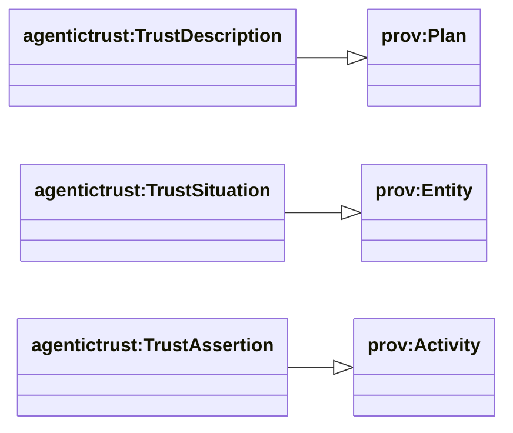
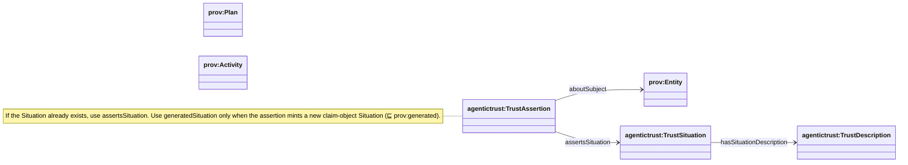

## Provenance (PROV-O grounding)

Ontology: `agentictrust-core.owl`

### Class hierarchy (PROV grounding)

### Relationship diagram (alias properties)

### Diagram

### What we use PROV-O for

We ground trust and execution in PROV so:

- “plans” and “situations” are compatible with existing provenance tooling
- we can connect agent metadata fetches, invocations, and produced artifacts/assertions

### Core correspondences

- **`agentictrust:TrustDescription`** ⊑ `prov:Plan` and `p-plan:Plan`
- **`agentictrust:TrustSituation`** ⊑ `prov:Entity`
- **`agentictrust:TrustAssertion`** ⊑ `prov:Activity`

### Common provenance patterns in this repo

- **Agent card fetch**:
  - `agentictrust:AgentDescriptorFetch` (Activity) `prov:generated` → `agentictrust:AgentDescriptor`
  - timestamp via `prov:endedAtTime`

- **Invocation trace**:
  - `agentictrust:SkillInvocation` (Activity) links to the invoked `Skill` and input `Message`

### Where assertions land

Trust claims land as subclasses of `agentictrust:TrustAssertion`:

- Verification: `agentictrust:VerificationAssertion` (used by ERC8004 validation responses)
- Reputation: `agentictrust:ReputationAssertion` (used by ERC8004 feedback)
- Relationship assertions: `agentictrust:RelationshipAssertion` (used by ERC8092)

