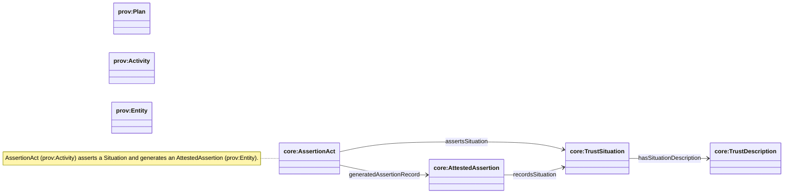

## Provenance (PROV-O grounding)

Ontology: `apps/ontology/ontology/core.ttl`

### Class hierarchy (PROV grounding)

### Relationship diagram (alias properties)

### Diagram

### What we use PROV-O for

We ground trust and execution in PROV so:

- “plans” and “situations” are compatible with existing provenance tooling
- we can connect agent metadata fetches, invocations, and produced artifacts/assertions

### Core correspondences

- **`core:TrustDescription`** ⊑ `prov:Plan` and `p-plan:Plan`
- **`core:TrustSituation`** ⊑ `prov:Entity`
- **`core:AssertionAct`** ⊑ `prov:Activity` (the act of asserting)
- **`core:AttestedAssertion`** ⊑ `prov:Entity` (the durable record/artifact produced by an Attestation)

### Common provenance patterns in this repo

- **Agent card fetch**:
  - `core:AgentDescriptorFetch` (Activity) `prov:generated` → `core:AgentDescriptor`
  - timestamp via `prov:endedAtTime`

- **Invocation trace**:
  - `core:SkillInvocation` (Activity) links to the invoked `AgentSkillClassification` and input `Message`

### Where assertions land

Trust claims land as subclasses of `core:AttestedAssertion` (durable entities) and `core:AssertionAct` (activities):

- **Verification**:
  - `core:VerificationTrustAssertion` (Record) - used by ERC8004 validation responses
  - `core:VerificationTrustAssertionAct` (Act) - the act of validating
- **Reputation**:
  - `core:ReputationTrustAssertion` (Record) - used by ERC8004 feedback
  - `core:ReputationTrustAssertionAct` (Act) - the act of providing feedback
- **Relationship**:
  - `core:RelationshipTrustAssertion` (Record) - used by ERC8092
  - `core:RelationshipTrustAssertionAct` (Act) - the act of asserting relationships

