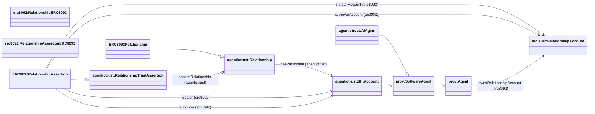

## RelationshipAssertion (assertion → account → agent)

This page documents the **RelationshipAssertion → RelationshipAccount → Agent** pattern used to represent ERC‑8092 "associated accounts" data in a graph-friendly way.

### Diagram



### SPARQL Queries (demonstrating property relationships)

**Query RelationshipAssertion with Relationship and Accounts:**
```sparql
PREFIX erc8092: <https://www.agentictrust.io/ontology/ERC8092#>
PREFIX agentictrust: <https://www.agentictrust.io/ontology/agentictrust-core#>

SELECT ?relationshipAssertion ?relationship ?initiatorAccount ?approverAccount ?initiator ?approver
WHERE {
  ?relationshipAssertion a erc8092:RelationshipAssertionERC8092 .
  
  OPTIONAL {
    ?relationshipAssertion agentictrust:assertsRelationship ?relationship .
  }
  OPTIONAL {
    ?relationshipAssertion erc8092:initiatorAccount ?initiatorAccount .
  }
  OPTIONAL {
    ?relationshipAssertion erc8092:approverAccount ?approverAccount .
  }
  OPTIONAL {
    ?relationshipAssertion erc8092:initiator ?initiator .
  }
  OPTIONAL {
    ?relationshipAssertion erc8092:approver ?approver .
  }
}
```

**Query Agent with RelationshipAccounts via ownsRelationshipAccount:**
```sparql
PREFIX erc8092: <https://www.agentictrust.io/ontology/ERC8092#>
PREFIX agentictrust: <https://www.agentictrust.io/ontology/agentictrust-core#>

SELECT ?agent ?agentId ?relationshipAccount ?relationshipAssertion
WHERE {
  ?agent a agentictrust:AIAgent ;
    agentictrust:agentId ?agentId ;
    erc8092:ownsRelationshipAccount ?relationshipAccount .
  
  OPTIONAL {
    {
      ?relationshipAssertion erc8092:initiatorAccount ?relationshipAccount .
    }
    UNION
    {
      ?relationshipAssertion erc8092:approverAccount ?relationshipAccount .
    }
  }
}
ORDER BY ?agentId
```

### Core idea

- **Relationship assertion** (`erc8092:RelationshipAssertionERC8092`) is the on-chain record.
- It names the participant **relationship accounts**:
  - `erc8092:initiatorAccount`
  - `erc8092:approverAccount`
- It also references the participant **Accounts** directly:
  - `erc8092:initiator` → `agentictrustEth:Account`
  - `erc8092:approver` → `agentictrustEth:Account`
- Those accounts are connected to the controlling identity via:
  - `erc8092:ownsRelationshipAccount` (domain `prov:Agent`, typically `agentictrust:AIAgent`)
- The assertion also **asserts** the underlying relationship instance:
  - `agentictrust:assertsRelationship` → `erc8092:RelationshipERC8092`
- The relationship links to participant Accounts via:
  - `agentictrust:hasParticipant` → `agentictrustEth:Account` (inherited from core Relationship)

This gives you multiple query paths:

- `RelationshipAssertion → RelationshipAccount ← ownsRelationshipAccount ← AIAgent`
- `RelationshipAssertion → Account (initiator/approver)`
- `Relationship → Account (via hasParticipant)`

**Note**: `Account` is now a subclass of `prov:SoftwareAgent`, enabling it to participate in relationships as an Agent and inherit `hasIdentifier` from `prov:Agent`.


