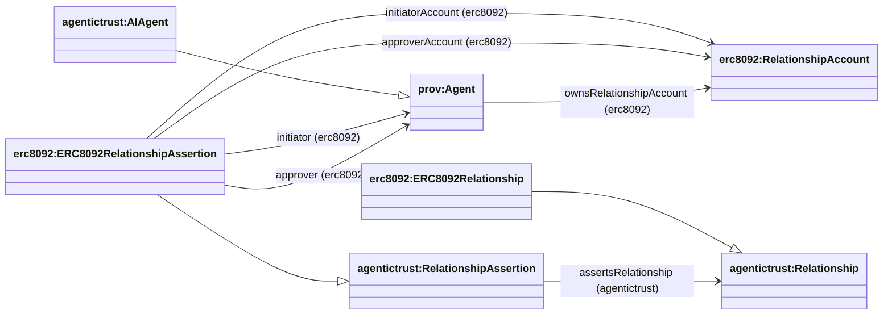

## RelationshipAssertion (assertion → account → agent)

This page documents the **RelationshipAssertion → RelationshipAccount → Agent** pattern used to represent ERC‑8092 “associated accounts” data in a graph-friendly way.

### Diagram

### Core idea

- **Relationship assertion** (`erc8092:ERC8092RelationshipAssertion`) is the on-chain record.
- It names the participant **relationship accounts**:
  - `erc8092:initiatorAccount`
  - `erc8092:approverAccount`
- Those accounts are connected to the controlling identity via:
  - `erc8092:ownsRelationshipAccount` (domain `prov:Agent`, typically `agentictrust:AIAgent`)
- The assertion also **asserts** the underlying relationship instance:
  - `agentictrust:assertsRelationship` → `erc8092:ERC8092Relationship`

This gives you a clean query path:

- `RelationshipAssertion → RelationshipAccount ← ownsRelationshipAccount ← AIAgent`

