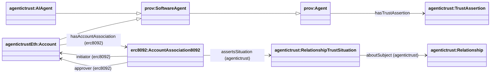

## AccountAssociation8092 (assertion → situation → relationship)

This page documents the **AccountAssociation8092 → RelationshipTrustSituation → AccountRelationship** pattern for ERC‑8092 association records, without using ERC‑8092 ontology classes on the Situation side.

### Diagram



### SPARQL Queries (demonstrating property relationships)

**Query AccountAssociation8092 with its asserted relationship situation:**
```sparql
PREFIX erc8092: <https://www.agentictrust.io/ontology/ERC8092#>
PREFIX agentictrust: <https://www.agentictrust.io/ontology/agentictrust-core#>

SELECT ?association ?situation ?relationship ?initiator ?approver ?initiatorAccountId ?approverAccountId
WHERE {
  ?association a erc8092:AccountAssociation8092 .
  OPTIONAL { ?association agentictrust:assertsSituation ?situation . }
  OPTIONAL { ?situation a agentictrust:RelationshipTrustSituation ; agentictrust:aboutSubject ?relationship . }
  OPTIONAL { ?association erc8092:initiator ?initiator . }
  OPTIONAL { ?association erc8092:approver ?approver . }
  OPTIONAL { ?association erc8092:initiatorAccountId ?initiatorAccountId . }
  OPTIONAL { ?association erc8092:approverAccountId ?approverAccountId . }
}
```

### Core idea

- **Account association** (`erc8092:AccountAssociation8092`) is the on-chain record.
- It names the participant **relationship accounts**:
  - `erc8092:initiatorAccount`
  - `erc8092:approverAccount`
- It also references the participant **Accounts** directly:
  - `erc8092:initiator` → `agentictrustEth:Account`
  - `erc8092:approver` → `agentictrustEth:Account`
- Those accounts are connected to the controlling identity via:
  - `erc8092:ownsRelationshipAccount` (domain `prov:Agent`, typically `agentictrust:AIAgent`)
- The association asserts a relationship trust situation:
  - `agentictrust:assertsSituation` → `agentictrust:RelationshipTrustSituation`
- The relationship links to participant Accounts via:
  - `agentictrust:hasParticipant` → `agentictrustEth:Account` (inherited from core Relationship)

This gives you multiple query paths:

- `RelationshipAssertion → RelationshipAccount ← ownsRelationshipAccount ← AIAgent`
- `RelationshipAssertion → Account (initiator/approver)`
- `Relationship → Account (via hasParticipant)`

**Note**: `Account` is now a subclass of `prov:SoftwareAgent`, enabling it to participate in relationships as an Agent and inherit `hasIdentifier` from `prov:Agent`.


