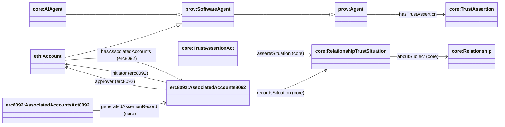

## AssociatedAccounts8092 (assertion → situation → relationship)

This page documents the **AssociatedAccounts8092 → RelationshipTrustSituation → AccountRelationship** pattern for ERC‑8092 associated-accounts records, without using ERC‑8092 ontology classes on the Situation side.

### Diagram



### SPARQL Queries (demonstrating property relationships)

**Query AssociatedAccounts8092 with its asserted relationship situation:**
```sparql
PREFIX erc8092: <https://agentictrust.io/ontology/erc8092#>
PREFIX core: <https://agentictrust.io/ontology/core#>

SELECT ?association ?situation ?relationship ?initiator ?approver ?initiatorAccountId ?approverAccountId
WHERE {
  ?association a erc8092:AssociatedAccounts8092 .
  OPTIONAL { ?association core:recordsSituation ?situation . }
  OPTIONAL { ?situation a core:RelationshipTrustSituation ; core:aboutSubject ?relationship . }
  OPTIONAL { ?association erc8092:initiator ?initiator . }
  OPTIONAL { ?association erc8092:approver ?approver . }
  OPTIONAL { ?association erc8092:initiatorAccountId ?initiatorAccountId . }
  OPTIONAL { ?association erc8092:approverAccountId ?approverAccountId . }
}
```

### Core idea

- **Associated accounts** (`erc8092:AssociatedAccounts8092`) is the on-chain record.
- It names the participant **relationship accounts**:
  - `erc8092:initiatorAccount`
  - `erc8092:approverAccount`
- It also references the participant **Accounts** directly:
  - `erc8092:initiator` → `eth:Account`
  - `erc8092:approver` → `eth:Account`
- Those accounts are connected to the controlling identity via:
  - `erc8092:ownsRelationshipAccount` (domain `prov:Agent`, typically `core:AIAgent`)
- The record points at a relationship trust situation:
  - `core:recordsSituation` → `core:RelationshipTrustSituation`
- The relationship links to participant Accounts via:
  - `core:hasParticipant` → `eth:Account` (inherited from core Relationship)

This gives you multiple query paths:

- `RelationshipAssertion → RelationshipAccount ← ownsRelationshipAccount ← AIAgent`
- `RelationshipAssertion → Account (initiator/approver)`
- `Relationship → Account (via hasParticipant)`

**Note**: `Account` is now a subclass of `prov:SoftwareAgent`, enabling it to participate in relationships as an Agent and inherit `hasIdentifier` from `prov:Agent`.


