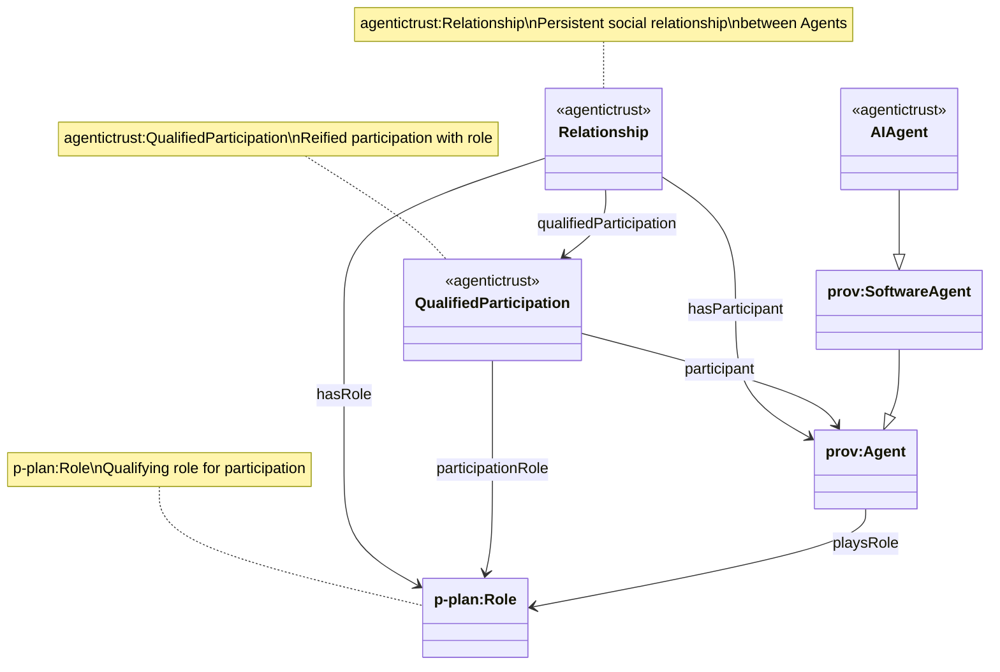
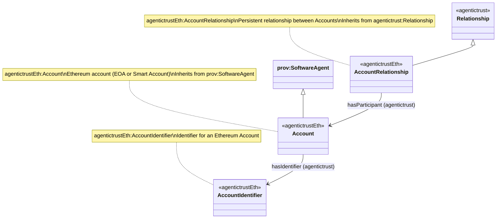
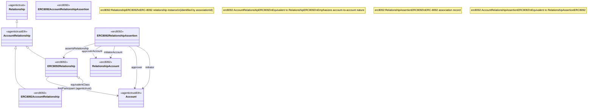

# Relationships, Roles, and Participation

This document describes the relationship model with participant and role support, from the core ontology through Ethereum-specific and ERC-8092 concrete implementations.

## Overview

The relationship model supports:
- **Relationships**: Persistent social relationships between Agents
- **Participants**: Agents that participate in relationships
- **Roles**: Qualifying roles for participation (using p-plan:Role)
- **Qualified Participation**: Reified participation linking Relationship → Agent → Role

## Core Relationship Model (agentictrust-core)

### Class Hierarchy



### Core Properties

- `agentictrust:hasParticipant`: Links a Relationship to an Agent that participates in it
- `agentictrust:qualifiedParticipation`: Links a Relationship to a QualifiedParticipation instance
- `agentictrust:participant`: Links a QualifiedParticipation to the Agent that participates
- `agentictrust:participationRole`: Links a QualifiedParticipation to the Role (p-plan:Role) that qualifies the participation
- `agentictrust:hasRole`: Links a Relationship to a Role (p-plan:Role) that is used in the relationship
- `agentictrust:playsRole`: Links an Agent to a Role (p-plan:Role) that it plays

### SPARQL Query: Core Relationship with Participants

```sparql
PREFIX agentictrust: <https://www.agentictrust.io/ontology/agentictrust-core#>
PREFIX prov: <http://www.w3.org/ns/prov#>

SELECT ?relationship ?participant
WHERE {
  ?relationship a agentictrust:Relationship .
  ?relationship agentictrust:hasParticipant ?participant .
  ?participant a prov:Agent .
}
```

### SPARQL Query: Relationship with Qualified Participation

```sparql
PREFIX agentictrust: <https://www.agentictrust.io/ontology/agentictrust-core#>
PREFIX p-plan: <http://purl.org/net/p-plan#>
PREFIX prov: <http://www.w3.org/ns/prov#>

SELECT ?relationship ?participant ?role
WHERE {
  ?relationship a agentictrust:Relationship .
  ?relationship agentictrust:qualifiedParticipation ?qualifiedParticipation .
  ?qualifiedParticipation agentictrust:participant ?participant .
  ?qualifiedParticipation agentictrust:participationRole ?role .
  ?participant a prov:Agent .
  ?role a p-plan:Role .
}
```

### SPARQL Query: Agent Roles

```sparql
PREFIX agentictrust: <https://www.agentictrust.io/ontology/agentictrust-core#>
PREFIX p-plan: <http://purl.org/net/p-plan#>
PREFIX prov: <http://www.w3.org/ns/prov#>

SELECT ?agent ?role
WHERE {
  ?agent a prov:Agent .
  ?agent agentictrust:playsRole ?role .
  ?role a p-plan:Role .
}
```

## Ethereum Account Relationship Model (agentictrust-eth)

### Class Hierarchy



### Key Changes

- **Account** is now a subclass of `prov:SoftwareAgent` (not just `prov:Entity`), enabling it to participate in relationships as an Agent
- **AccountRelationship** inherits from `agentictrust:Relationship`, inheriting all participant and role properties
- **Account** inherits `hasIdentifier` from `prov:Agent`, linking to `AccountIdentifier`

### SPARQL Query: Account Relationship with Participants

```sparql
PREFIX agentictrust: <https://www.agentictrust.io/ontology/agentictrust-core#>
PREFIX agentictrustEth: <https://www.agentictrust.io/ontology/agentictrust-eth#>
PREFIX prov: <http://www.w3.org/ns/prov#>

SELECT ?accountRelationship ?participantAccount ?accountIdentifier
WHERE {
  ?accountRelationship a agentictrustEth:AccountRelationship .
  ?accountRelationship agentictrust:hasParticipant ?participantAccount .
  ?participantAccount a agentictrustEth:Account .
  ?participantAccount agentictrust:hasIdentifier ?accountIdentifier .
  ?accountIdentifier a agentictrustEth:AccountIdentifier .
}
```

### SPARQL Query: Account with Identifier

```sparql
PREFIX agentictrust: <https://www.agentictrust.io/ontology/agentictrust-core#>
PREFIX agentictrustEth: <https://www.agentictrust.io/ontology/agentictrust-eth#>
PREFIX prov: <http://www.w3.org/ns/prov#>

SELECT ?account ?accountAddress ?accountIdentifier ?did
WHERE {
  ?account a agentictrustEth:Account ;
    agentictrustEth:accountAddress ?accountAddress ;
    agentictrust:hasIdentifier ?accountIdentifier .
  ?accountIdentifier a agentictrustEth:AccountIdentifier .
  OPTIONAL {
    ?accountIdentifier agentictrustEth:hasDID ?did .
  }
}
```

## ERC-8092 Relationship Model

### Class Hierarchy



### ERC-8092 Properties

- `erc8092:hasParticipant`: ERC-8092 specific property linking a Relationship to an Agent (subproperty of `agentictrust:hasParticipant`)
- `erc8092:qualifiedParticipation`: ERC-8092 specific property (subproperty of `agentictrust:qualifiedParticipation`)
- `erc8092:hasRole`: ERC-8092 specific property (subproperty of `agentictrust:hasRole`)
- `erc8092:initiator`: The initiator Account
- `erc8092:approver`: The approver Account
- `erc8092:initiatorAccount`: The initiator RelationshipAccount
- `erc8092:approverAccount`: The approver RelationshipAccount

### SPARQL Query: ERC-8092 Relationship with Participants

```sparql
PREFIX erc8092: <https://www.agentictrust.io/ontology/ERC8092#>
PREFIX agentictrust: <https://www.agentictrust.io/ontology/agentictrust-core#>
PREFIX agentictrustEth: <https://www.agentictrust.io/ontology/agentictrust-eth#>

SELECT ?relationship ?relationshipId ?participantAccount ?accountAddress
WHERE {
  ?relationship a erc8092:RelationshipERC8092 ;
    erc8092:relationshipId ?relationshipId ;
    agentictrust:hasParticipant ?participantAccount .
  ?participantAccount a agentictrustEth:Account ;
    agentictrustEth:accountAddress ?accountAddress .
}
```

### SPARQL Query: ERC-8092 Relationship Assertion with Participants

```sparql
PREFIX erc8092: <https://www.agentictrust.io/ontology/ERC8092#>
PREFIX agentictrust: <https://www.agentictrust.io/ontology/agentictrust-core#>
PREFIX agentictrustEth: <https://www.agentictrust.io/ontology/agentictrust-eth#>

SELECT ?assertion ?relationship ?initiator ?approver ?initiatorAccount ?approverAccount
WHERE {
  ?assertion a erc8092:RelationshipAssertionERC8092 ;
    agentictrust:assertsRelationship ?relationship .
  
  OPTIONAL {
    ?assertion erc8092:initiator ?initiator .
    ?initiator a agentictrustEth:Account .
  }
  OPTIONAL {
    ?assertion erc8092:approver ?approver .
    ?approver a agentictrustEth:Account .
  }
  OPTIONAL {
    ?assertion erc8092:initiatorAccount ?initiatorAccount .
  }
  OPTIONAL {
    ?assertion erc8092:approverAccount ?approverAccount .
  }
}
```

### SPARQL Query: Complete ERC-8092 Relationship Pattern

This query shows the complete pattern: Relationship Assertion → Relationship → Participants (via both assertion properties and relationship hasParticipant):

```sparql
PREFIX erc8092: <https://www.agentictrust.io/ontology/ERC8092#>
PREFIX agentictrust: <https://www.agentictrust.io/ontology/agentictrust-core#>
PREFIX agentictrustEth: <https://www.agentictrust.io/ontology/agentictrust-eth#>

SELECT ?assertion ?relationship ?relationshipId 
       ?initiator ?initiatorAddress ?approver ?approverAddress
       ?participantViaAssertion ?participantViaRelationship
WHERE {
  ?assertion a erc8092:RelationshipAssertionERC8092 ;
    agentictrust:assertsRelationship ?relationship .
  
  ?relationship a erc8092:RelationshipERC8092 ;
    erc8092:relationshipId ?relationshipId .
  
  # Participants via assertion
  OPTIONAL {
    ?assertion erc8092:initiator ?initiator .
    ?initiator a agentictrustEth:Account ;
      agentictrustEth:accountAddress ?initiatorAddress .
  }
  OPTIONAL {
    ?assertion erc8092:approver ?approver .
    ?approver a agentictrustEth:Account ;
      agentictrustEth:accountAddress ?approverAddress .
  }
  
  # Participants via relationship hasParticipant
  OPTIONAL {
    ?relationship agentictrust:hasParticipant ?participantViaRelationship .
    ?participantViaRelationship a agentictrustEth:Account .
  }
}
```

### SPARQL Query: Relationship with Qualified Participation (ERC-8092)

```sparql
PREFIX erc8092: <https://www.agentictrust.io/ontology/ERC8092#>
PREFIX agentictrust: <https://www.agentictrust.io/ontology/agentictrust-core#>
PREFIX agentictrustEth: <https://www.agentictrust.io/ontology/agentictrust-eth#>
PREFIX p-plan: <http://purl.org/net/p-plan#>

SELECT ?relationship ?participantAccount ?role
WHERE {
  ?relationship a erc8092:RelationshipERC8092 .
  ?relationship agentictrust:qualifiedParticipation ?qualifiedParticipation .
  ?qualifiedParticipation agentictrust:participant ?participantAccount .
  ?qualifiedParticipation agentictrust:participationRole ?role .
  ?participantAccount a agentictrustEth:Account .
  ?role a p-plan:Role .
}
```

## Summary

The relationship model provides a layered approach:

1. **Core Level** (`agentictrust-core`): Abstract Relationship with participant and role support
2. **Ethereum Level** (`agentictrust-eth`): AccountRelationship for account-to-account relationships, with Account as SoftwareAgent
3. **ERC-8092 Level** (`ERC8092`): Concrete ERC-8092 relationship implementation with assertion and account details

All levels support:
- Direct participant links via `hasParticipant`
- Role-qualified participation via `QualifiedParticipation`
- Role assignment via `hasRole` and `playsRole`

