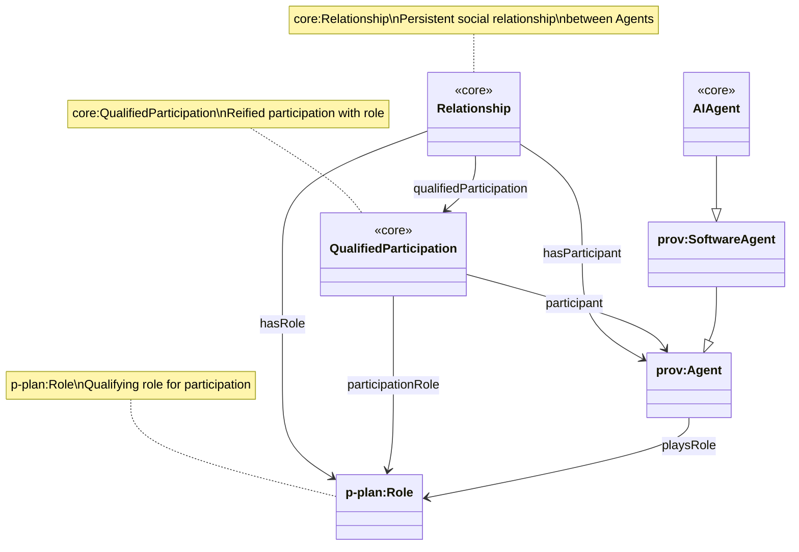
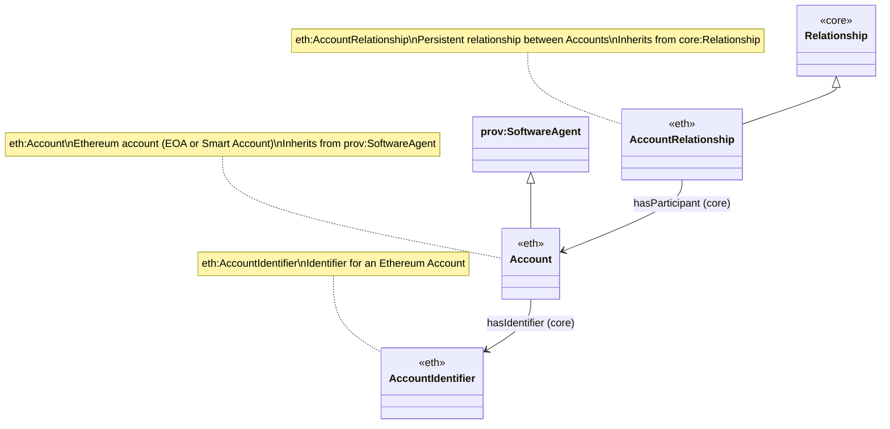
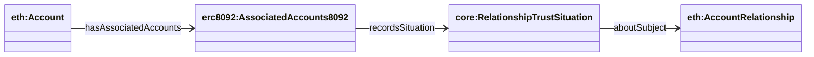

# Relationships, Roles, and Participation

This document describes the relationship model with participant and role support, from the core ontology through Ethereum-specific and ERC-8092 concrete implementations.

## Overview

The relationship model supports:
- **Relationships**: Persistent social relationships between Agents
- **Participants**: Agents that participate in relationships
- **Roles**: Qualifying roles for participation (using p-plan:Role)
- **Qualified Participation**: Reified participation linking Relationship → Agent → Role

## Core Relationship Model (core-core)

### Class Hierarchy



### Core Properties

- `core:hasParticipant`: Links a Relationship to an Agent that participates in it
- `core:qualifiedParticipation`: Links a Relationship to a QualifiedParticipation instance
- `core:participant`: Links a QualifiedParticipation to the Agent that participates
- `core:participationRole`: Links a QualifiedParticipation to the Role (p-plan:Role) that qualifies the participation
- `core:hasRole`: Links a Relationship to a Role (p-plan:Role) that is used in the relationship
- `core:playsRole`: Links an Agent to a Role (p-plan:Role) that it plays

### SPARQL Query: Core Relationship with Participants

```sparql
PREFIX core: <https://core.io/ontology/core#>
PREFIX prov: <http://www.w3.org/ns/prov#>

SELECT ?relationship ?participant
WHERE {
  ?relationship a core:Relationship .
  ?relationship core:hasParticipant ?participant .
  ?participant a prov:Agent .
}
```

### SPARQL Query: Relationship with Qualified Participation

```sparql
PREFIX core: <https://core.io/ontology/core#>
PREFIX p-plan: <http://purl.org/net/p-plan#>
PREFIX prov: <http://www.w3.org/ns/prov#>

SELECT ?relationship ?participant ?role
WHERE {
  ?relationship a core:Relationship .
  ?relationship core:qualifiedParticipation ?qualifiedParticipation .
  ?qualifiedParticipation core:participant ?participant .
  ?qualifiedParticipation core:participationRole ?role .
  ?participant a prov:Agent .
  ?role a p-plan:Role .
}
```

### SPARQL Query: Agent Roles

```sparql
PREFIX core: <https://core.io/ontology/core#>
PREFIX p-plan: <http://purl.org/net/p-plan#>
PREFIX prov: <http://www.w3.org/ns/prov#>

SELECT ?agent ?role
WHERE {
  ?agent a prov:Agent .
  ?agent core:playsRole ?role .
  ?role a p-plan:Role .
}
```

## Ethereum Account Relationship Model (core-eth)

### Class Hierarchy



### Key Changes

- **Account** is now a subclass of `prov:SoftwareAgent` (not just `prov:Entity`), enabling it to participate in relationships as an Agent
- **AccountRelationship** inherits from `core:Relationship`, inheriting all participant and role properties
- **Account** inherits `hasIdentifier` from `prov:Agent`, linking to `AccountIdentifier`

### SPARQL Query: Account Relationship with Participants

```sparql
PREFIX core: <https://core.io/ontology/core#>
PREFIX eth: <https://core.io/ontology/eth#>
PREFIX prov: <http://www.w3.org/ns/prov#>

SELECT ?accountRelationship ?participantAccount ?accountIdentifier
WHERE {
  ?accountRelationship a eth:AccountRelationship .
  ?accountRelationship core:hasParticipant ?participantAccount .
  ?participantAccount a eth:Account .
  ?participantAccount core:hasIdentifier ?accountIdentifier .
  ?accountIdentifier a eth:AccountIdentifier .
}
```

### SPARQL Query: Account with Identifier

```sparql
PREFIX core: <https://core.io/ontology/core#>
PREFIX eth: <https://core.io/ontology/eth#>
PREFIX prov: <http://www.w3.org/ns/prov#>

SELECT ?account ?accountAddress ?accountIdentifier ?did
WHERE {
  ?account a eth:Account ;
    eth:accountAddress ?accountAddress ;
    core:hasIdentifier ?accountIdentifier .
  ?accountIdentifier a eth:AccountIdentifier .
  OPTIONAL {
    ?accountIdentifier eth:hasDID ?did .
  }
}
```

## ERC-8092 Association Model (assertion-side only)

ERC-8092 intentionally defines only **assertion-side** terms. The relationship/situation modeling stays in `apps/ontology/ontology/core.ttl` + `apps/ontology/ontology/eth.ttl`.



### ERC-8092 association assertions (assertion-side only)

ERC-8092 is modeled as **assertion-side only**:

- `erc8092:AssociatedAccounts8092` (associated-accounts record, as a durable assertion record)
- `erc8092:AssociatedAccountsRevocation8092` (revocation)

The association record points at a **Situation** in core:

- `core:recordsSituation` → `core:RelationshipTrustSituation`
- `core:aboutSubject` (on the situation) → `eth:AccountRelationship`

### SPARQL Query: ERC-8092 AssociatedAccounts8092 asserted relationship situation

```sparql
PREFIX erc8092: <https://core.io/ontology/erc8092#>
PREFIX core: <https://core.io/ontology/core#>
PREFIX eth: <https://core.io/ontology/eth#>

SELECT ?association ?situation ?relationship ?initiator ?approver ?initiatorAccountId ?approverAccountId
WHERE {
  ?association a erc8092:AssociatedAccounts8092 .
  OPTIONAL { ?association core:recordsSituation ?situation . }
  OPTIONAL {
    ?situation a core:RelationshipTrustSituation ;
      core:aboutSubject ?relationship .
    ?relationship a eth:AccountRelationship .
  }
  OPTIONAL { ?association erc8092:initiator ?initiator . }
  OPTIONAL { ?association erc8092:approver ?approver . }
  OPTIONAL { ?association erc8092:initiatorAccountId ?initiatorAccountId . }
  OPTIONAL { ?association erc8092:approverAccountId ?approverAccountId . }
}
LIMIT 200
```

### SPARQL Query: Relationship with Qualified Participation (ERC-8092)

```sparql
PREFIX erc8092: <https://core.io/ontology/erc8092#>
PREFIX core: <https://core.io/ontology/core#>
PREFIX eth: <https://core.io/ontology/eth#>
PREFIX p-plan: <http://purl.org/net/p-plan#>

SELECT ?relationship ?participantAccount ?role
WHERE {
  ?relationship a eth:AccountRelationship .
  ?relationship core:qualifiedParticipation ?qualifiedParticipation .
  ?qualifiedParticipation core:participant ?participantAccount .
  ?qualifiedParticipation core:participationRole ?role .
  ?participantAccount a eth:Account .
  ?role a p-plan:Role .
}
```

## Summary

The relationship model provides a layered approach:

1. **Core Level** (`core-core`): Abstract Relationship with participant and role support
2. **Ethereum Level** (`core-eth`): AccountRelationship for account-to-account relationships, with Account as SoftwareAgent
3. **ERC-8092 Level** (`ERC8092`): Concrete ERC-8092 relationship implementation with assertion and account details

All levels support:
- Direct participant links via `hasParticipant`
- Role-qualified participation via `QualifiedParticipation`
- Role assignment via `hasRole` and `playsRole`

