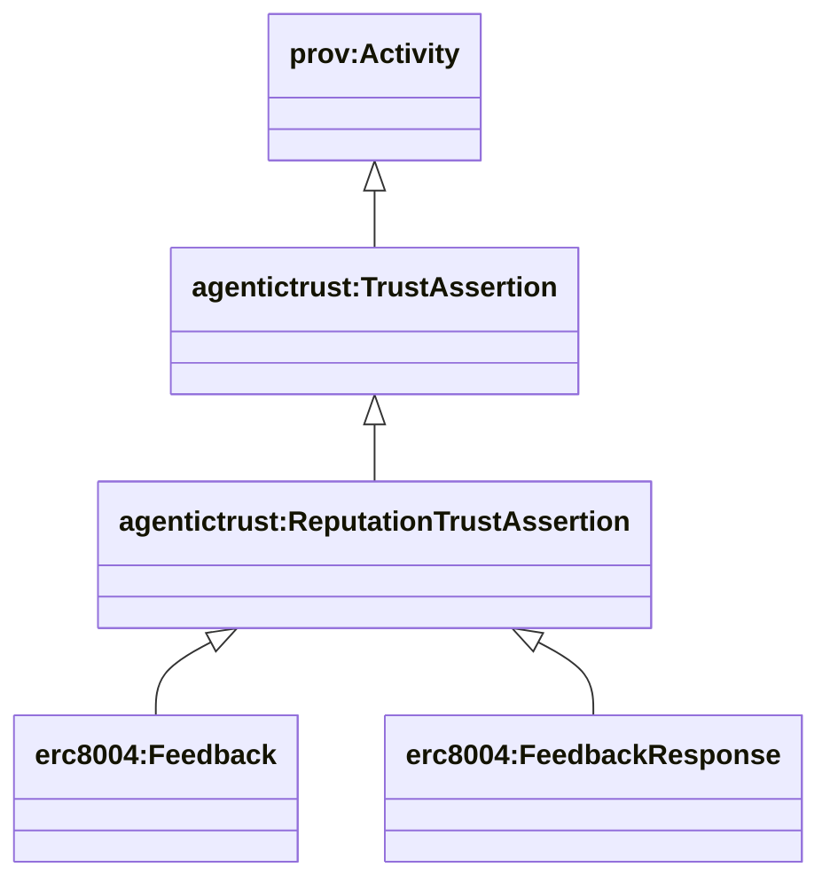
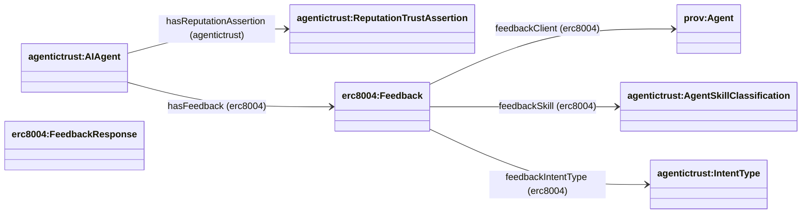

## ReputationTrustAssertion

This page documents the **ReputationTrustAssertion** class hierarchy and property relationships used to represent agent feedback and reputation claims.

### Class Hierarchy



**Inheritance chain:**
- `prov:Entity` (base PROV-O class)
  - `agentictrust:TrustAssertion` (durable trust claim)
    - `agentictrust:ReputationTrustAssertion` (reputation/feedback claim)
      - `erc8004:Feedback` (ERC-8004 feedback record)
      - `erc8004:FeedbackResponse` (response to feedback)

### Property Relationships



### Core Properties

#### Agent → Assertion Links

- **`agentictrust:hasReputationAssertion`** (domain: `prov:Agent`, range: `agentictrust:ReputationTrustAssertion`)
  - Links an agent to reputation assertions about it or produced by it
  - Subproperty of `agentictrust:hasTrustAssertion`

- **`erc8004:hasFeedback`** (domain: `agentictrust:AIAgent`, range: `erc8004:Feedback`)
  - ERC-8004 specific property linking agents to feedback records
  - Subproperty of `agentictrust:hasReputationAssertion`

#### Feedback Context Links

- **`erc8004:feedbackClient`** (domain: `erc8004:Feedback`, range: `prov:Agent`)
  - Links feedback to the client/agent that provided it

- **`erc8004:feedbackSkill`** (domain: `erc8004:Feedback`, range: `agentictrust:AgentSkillClassification`)
  - Links feedback to the skill it relates to

- **`erc8004:feedbackIntentType`** (domain: `erc8004:Feedback`, range: `agentictrust:IntentType`)
  - Links feedback to the intent type it relates to

### Datatype Properties

**Feedback properties:**
- `erc8004:feedbackIndex` (xsd:integer) - Feedback index
- `erc8004:feedbackScore` (xsd:integer) - Feedback score
- `erc8004:feedbackRatingPct` (xsd:integer) - Rating percentage
- `erc8004:isRevoked` (xsd:boolean) - Whether feedback is revoked

**FeedbackResponse properties:**
- Similar structure for response records

### Usage Pattern

**Query all reputation assertions for an agent:**
```sparql
PREFIX agentictrust: <https://www.agentictrust.io/ontology/agentictrust-core#>
PREFIX erc8004: <https://www.agentictrust.io/ontology/ERC8004#>

SELECT ?agent ?agentId ?reputationAssertion ?feedbackScore
WHERE {
  ?agent a agentictrust:AIAgent ;
    agentictrust:hasReputationAssertion ?reputationAssertion .
  
  ?reputationAssertion a agentictrust:ReputationTrustAssertion .
  
  OPTIONAL {
    ?agent agentictrust:agentId ?agentId .
  }
  OPTIONAL {
    ?reputationAssertion erc8004:feedbackScore ?feedbackScore .
  }
}
```

**Query feedback with context (client, skill, intent):**
```sparql
PREFIX erc8004: <https://www.agentictrust.io/ontology/ERC8004#>
PREFIX agentictrust: <https://www.agentictrust.io/ontology/agentictrust-core#>

SELECT ?agent ?feedback ?feedbackScore ?client ?skill ?intentType
WHERE {
  ?agent erc8004:hasFeedback ?feedback .
  
  ?feedback erc8004:feedbackScore ?feedbackScore .
  
  OPTIONAL {
    ?feedback erc8004:feedbackClient ?client .
  }
  OPTIONAL {
    ?feedback erc8004:feedbackSkill ?skill .
  }
  OPTIONAL {
    ?feedback erc8004:feedbackIntentType ?intentType .
  }
}
```

**Query average feedback score per agent:**
```sparql
PREFIX erc8004: <https://www.agentictrust.io/ontology/ERC8004#>

SELECT ?agent (AVG(?score) AS ?avgScore) (COUNT(?feedback) AS ?feedbackCount)
WHERE {
  ?agent erc8004:hasFeedback ?feedback .
  ?feedback erc8004:feedbackScore ?score .
  FILTER(?score > 0)
}
GROUP BY ?agent
ORDER BY DESC(?avgScore)
```

### Related Concepts

- **TrustAssertion**: ReputationAssertion is a subclass of TrustAssertion
- **Skill**: Feedback can be linked to specific skills via `feedbackSkill`
- **IntentType**: Feedback can be linked to intent types via `feedbackIntentType`
- **TrustSituation**: Feedback may be generated by trust situations
- See also: [ERC-8004 documentation](./erc8004.md), [Situation](./situation.md), [Skills and Intents](./skills-intents-tasks.md)

