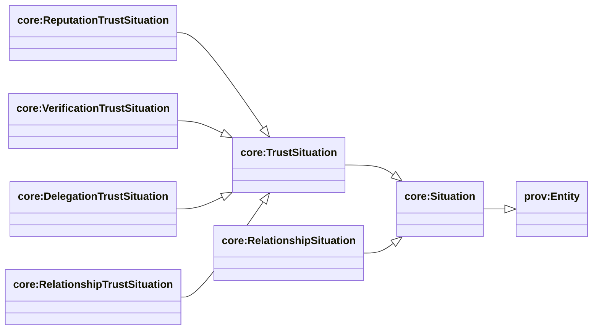
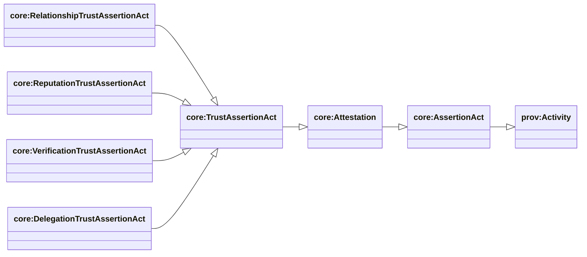
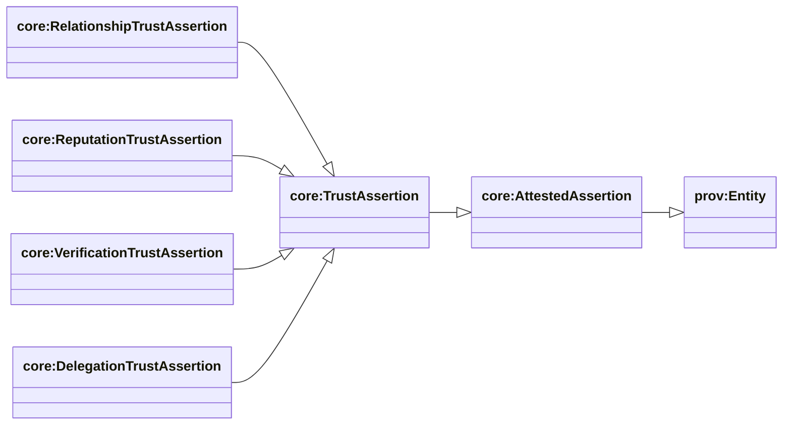
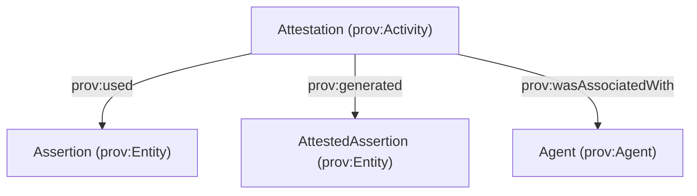
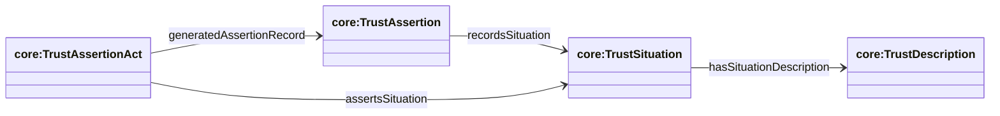
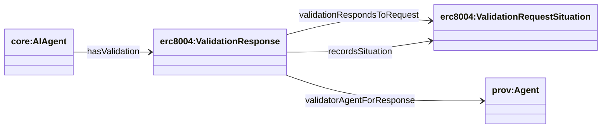
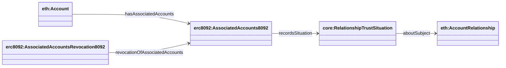
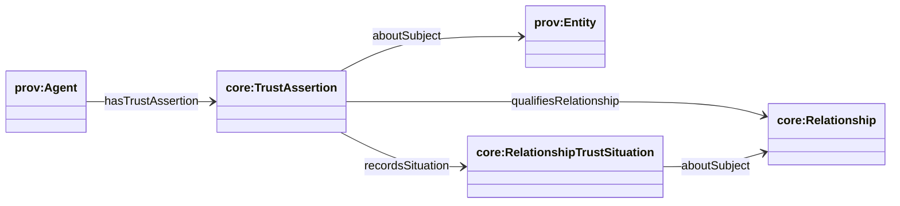
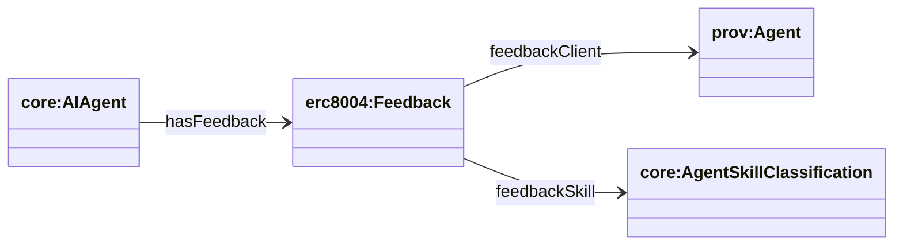

## Situation layer (DnS) — how trust + work happens

Ontology: `apps/ontology/ontology/core.ttl`

In this ontology, **Situation is not an event**.

- `core:TrustSituation` is a **prov:Entity**: “what is being claimed to hold”.
- `core:TrustAssertion` is a **prov:Entity**: the durable trust claim record (citable).
- `core:TrustAssertionAct` is a **prov:Activity**: the time-scoped act that generates the record and asserts a situation.

### Situation hierarchy (prov:Entity)



### SPARQL: Situation hierarchy + instances

**List subclasses of `core:Situation`:**

```sparql
PREFIX rdfs: <http://www.w3.org/2000/01/rdf-schema#>
PREFIX core: <https://agentictrust.io/ontology/core#>

SELECT ?cls
WHERE {
  ?cls rdfs:subClassOf* core:Situation .
}
ORDER BY ?cls
```

**List instances (any subtype of Situation):**

```sparql
PREFIX rdfs: <http://www.w3.org/2000/01/rdf-schema#>
PREFIX core: <https://agentictrust.io/ontology/core#>

SELECT ?situation ?type
WHERE {
  ?situation a ?type .
  ?type rdfs:subClassOf* core:Situation .
}
ORDER BY ?type ?situation
LIMIT 200
```

### AssertionAct hierarchy (prov:Activity)



### AttestedAssertion hierarchy (prov:Entity)



### Assertion vs Attestation (PROV-O accountability)

AgenticTrust separates **epistemic neutrality** (an *Assertion* as content) from **social accountability** (an *Attestation* as an act by an Agent).

Conceptual flow (PROV-O):

- **Assertion** (`core:Assertion`) is a `prov:Entity` (no agent responsibility implied)
  - `prov:Entity` only
- **Attestation** (`core:Attestation`) is a `prov:Activity` (agent-accountable act)
  - `prov:Activity`
  - `prov:wasAssociatedWith` → `prov:Agent`
  - `prov:used` → `core:Assertion`
  - `prov:generated` → `core:AttestedAssertion`
- **AttestedAssertion** (`core:AttestedAssertion`) is a `prov:Entity` (durable artifact produced by attestation)



### SPARQL: TrustAssertion (records) + asserted situations

**List subclasses of `core:TrustAssertion`:**

```sparql
PREFIX rdfs: <http://www.w3.org/2000/01/rdf-schema#>
PREFIX core: <https://agentictrust.io/ontology/core#>

SELECT ?cls
WHERE {
  ?cls rdfs:subClassOf* core:TrustAssertion .
}
ORDER BY ?cls
```

**TrustAssertions and the TrustSituation they generated:**

```sparql
PREFIX rdfs: <http://www.w3.org/2000/01/rdf-schema#>
PREFIX core: <https://agentictrust.io/ontology/core#>

SELECT ?assertion ?assertionType ?situation ?situationType
WHERE {
  ?assertion a ?assertionType .
  ?assertionType rdfs:subClassOf* core:TrustAssertion .
  OPTIONAL {
    ?assertion core:recordsSituation ?situation .
    OPTIONAL { ?situation a ?situationType . }
  }
}
ORDER BY ?assertionType ?assertion
LIMIT 200
```

### TrustSituation ↔ TrustAssertion (core links)



**SPARQL: TrustAssertion + asserted TrustSituation + description**

```sparql
PREFIX core: <https://agentictrust.io/ontology/core#>

SELECT ?trustAssertion ?trustSituation ?trustDescription
WHERE {
  ?trustAssertion a core:TrustAssertion .
  OPTIONAL { ?trustAssertion core:recordsSituation ?trustSituation . }
  OPTIONAL { ?trustSituation core:hasSituationDescription ?trustDescription . }
}
LIMIT 200
```

### ERC-8004 TrustSituation + TrustAssertion flows

Ontology: `apps/ontology/ontology/erc8004.ttl`

#### Validation (request → response)



**SPARQL: validation responses and their requests**

```sparql
PREFIX core: <https://agentictrust.io/ontology/core#>
PREFIX erc8004: <https://agentictrust.io/ontology/erc8004#>

SELECT ?agent ?response ?request ?validator
WHERE {
  ?agent erc8004:hasValidation ?response .
  OPTIONAL { ?response erc8004:validationRespondsToRequest ?request . }
  OPTIONAL { ?response core:recordsSituation ?request . }
  OPTIONAL { ?response erc8004:validatorAgentForResponse ?validator . }
}
ORDER BY ?agent ?response
LIMIT 200
```

## Abstract “Situation graph” query layer

These query-friendly abstractions are defined in `apps/ontology/ontology/core.ttl` so you can query consistently across trust sources:

- **Situation subject (evaluated agent)**: `core:isAboutAgent` (Situation → AIAgent)
- **Situation participants** (client/validator/org/etc.): `core:hasSituationParticipant` (Situation → Agent)
- **Assertion act → Situation**: `core:assertsSituation` (AssertionAct → Situation)
- **Assertion act author/performer**: `core:assertedBy` (AssertionAct → Agent)

### SPARQL: situations + evaluated agent + participants

```sparql
PREFIX core: <https://agentictrust.io/ontology/core#>

SELECT ?situation ?aboutAgent ?participant
WHERE {
  ?situation a core:Situation .
  OPTIONAL { ?situation core:isAboutAgent ?aboutAgent . }
  OPTIONAL { ?situation core:hasSituationParticipant ?participant . }
}
ORDER BY ?situation ?aboutAgent ?participant
LIMIT 200
```

### SPARQL: assertion acts + asserted situation + assertedBy

```sparql
PREFIX core: <https://agentictrust.io/ontology/core#>
PREFIX prov: <http://www.w3.org/ns/prov#>

SELECT ?act ?situation ?assertedBy
WHERE {
  ?act a prov:Activity ;
    core:assertsSituation ?situation .
  OPTIONAL { ?act core:assertedBy ?assertedBy . }
}
ORDER BY ?act ?situation
LIMIT 200
```

### ERC-8092 relationship flow

Ontology: `apps/ontology/ontology/erc8092.ttl` (assertion-side only)



Mappings (diagram edge labels → ontology properties):

- **hasAssociatedAccounts** → `erc8092:hasAssociatedAccounts`
- **recordsSituation** → `core:recordsSituation`
- **aboutSubject** → `core:aboutSubject`
- **revocationOfAssociatedAccounts** → `erc8092:revocationOfAssociatedAccounts`

**SPARQL: relationship assertions → relationship + participants**

```sparql
PREFIX erc8092: <https://agentictrust.io/ontology/erc8092#>
PREFIX core: <https://agentictrust.io/ontology/core#>

SELECT ?situation ?assertion ?initiator ?approver
WHERE {
  ?assertion a erc8092:AssociatedAccounts8092 .
  OPTIONAL { ?assertion core:recordsSituation ?situation . }
  OPTIONAL { ?assertion erc8092:initiator ?initiator . }
  OPTIONAL { ?assertion erc8092:approver ?approver . }
}
ORDER BY ?situation ?assertion
LIMIT 200
```

**SPARQL: relationship revocations**

```sparql
PREFIX erc8092: <https://agentictrust.io/ontology/erc8092#>

SELECT ?revocation ?ofAssertion ?revokedAt
WHERE {
  ?revocation a erc8092:AssociatedAccountsRevocation8092 .
  OPTIONAL { ?revocation erc8092:revocationOfAssociatedAccounts ?ofAssertion . }
  OPTIONAL { ?ofAssertion erc8092:revokedAt ?revokedAt . }
}
ORDER BY DESC(?revokedAt)
LIMIT 200
```

### Trust graph overlay (relationships + subjects)

This section shows the **registry-agnostic overlay** used to connect different trust signals into a single query shape.



Mappings (diagram edge labels → ontology properties):

- **hasTrustAssertion** → `core:hasTrustAssertion`
- **aboutSubject** → `core:aboutSubject`
- **qualifiesRelationship** → `core:qualifiesRelationship`
- **recordsSituation** → `core:recordsSituation`

**SPARQL: assertions about a subject (generic)**

```sparql
PREFIX core: <https://agentictrust.io/ontology/core#>

SELECT ?assertion ?subject
WHERE {
  ?assertion a core:TrustAssertion .
  ?assertion core:aboutSubject ?subject .
}
LIMIT 200
```

**SPARQL: relationship-qualified assertions**

```sparql
PREFIX core: <https://agentictrust.io/ontology/core#>

SELECT ?assertion ?relationship
WHERE {
  ?assertion a core:TrustAssertion ;
    core:qualifiesRelationship ?relationship .
}
LIMIT 200
```

**SPARQL: relationship trust situations asserted by trust assertions**

```sparql
PREFIX core: <https://agentictrust.io/ontology/core#>

SELECT ?assertion ?situation ?relationship
WHERE {
  ?assertion a core:TrustAssertion ;
    core:recordsSituation ?situation .
  ?situation a core:RelationshipTrustSituation ;
    core:aboutSubject ?relationship .
}
LIMIT 200
```

#### Reputation / feedback



**SPARQL: feedback records**

```sparql
PREFIX erc8004: <https://agentictrust.io/ontology/erc8004#>

SELECT ?agent ?feedback ?score ?ratingPct
WHERE {
  ?agent erc8004:hasFeedback ?feedback .
  OPTIONAL { ?feedback erc8004:feedbackScore ?score . }
  OPTIONAL { ?feedback erc8004:feedbackRatingPct ?ratingPct . }
}
ORDER BY ?agent ?feedback
LIMIT 200
```
