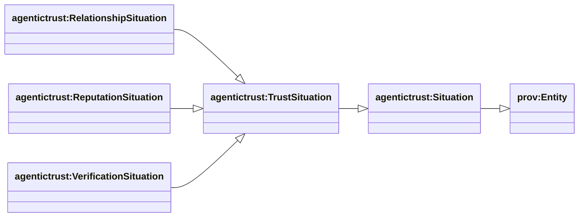
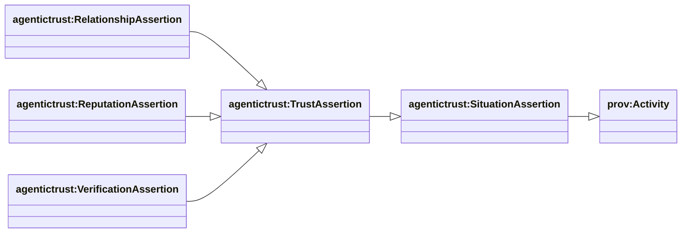
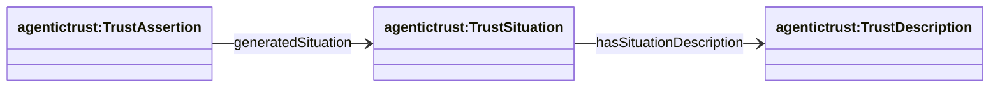
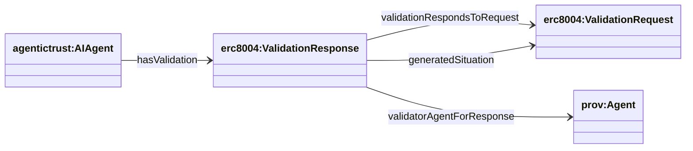
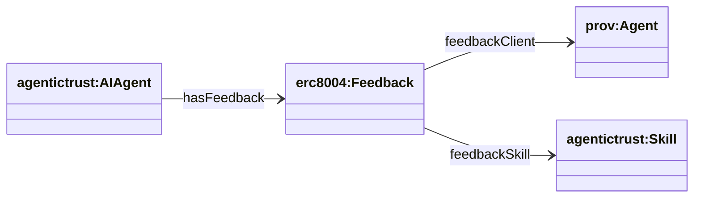

## Situation layer (DnS) — how trust + work happens

Ontology: `agentictrust-core.owl`

In this ontology, **Situation is not an event**.

- `agentictrust:TrustSituation` is a **prov:Entity**: “what is being claimed to hold”.
- `agentictrust:TrustAssertion` is a **prov:Activity**: the time-scoped act of asserting that situation.

### TrustSituation hierarchy (prov:Entity)



### SPARQL: TrustSituation hierarchy + instances

**List subclasses of `agentictrust:TrustSituation`:**

```sparql
PREFIX rdfs: <http://www.w3.org/2000/01/rdf-schema#>
PREFIX agentictrust: <https://www.agentictrust.io/ontology/agentictrust-core#>

SELECT ?cls
WHERE {
  ?cls rdfs:subClassOf* agentictrust:TrustSituation .
}
ORDER BY ?cls
```

**List instances (any subtype of TrustSituation):**

```sparql
PREFIX rdfs: <http://www.w3.org/2000/01/rdf-schema#>
PREFIX agentictrust: <https://www.agentictrust.io/ontology/agentictrust-core#>

SELECT ?situation ?type
WHERE {
  ?situation a ?type .
  ?type rdfs:subClassOf* agentictrust:TrustSituation .
}
ORDER BY ?type ?situation
LIMIT 200
```

### TrustAssertion hierarchy (prov:Activity)



### SPARQL: TrustAssertion hierarchy + instances

**List subclasses of `agentictrust:TrustAssertion`:**

```sparql
PREFIX rdfs: <http://www.w3.org/2000/01/rdf-schema#>
PREFIX agentictrust: <https://www.agentictrust.io/ontology/agentictrust-core#>

SELECT ?cls
WHERE {
  ?cls rdfs:subClassOf* agentictrust:TrustAssertion .
}
ORDER BY ?cls
```

**TrustAssertions and the TrustSituation they generated:**

```sparql
PREFIX rdfs: <http://www.w3.org/2000/01/rdf-schema#>
PREFIX agentictrust: <https://www.agentictrust.io/ontology/agentictrust-core#>

SELECT ?assertion ?assertionType ?situation ?situationType
WHERE {
  ?assertion a ?assertionType .
  ?assertionType rdfs:subClassOf* agentictrust:TrustAssertion .
  OPTIONAL {
    ?assertion agentictrust:generatedSituation ?situation .
    OPTIONAL { ?situation a ?situationType . }
  }
}
ORDER BY ?assertionType ?assertion
LIMIT 200
```

### TrustSituation ↔ TrustAssertion (core links)



**SPARQL: TrustAssertion + asserted TrustSituation + description**

```sparql
PREFIX agentictrust: <https://www.agentictrust.io/ontology/agentictrust-core#>

SELECT ?trustAssertion ?trustSituation ?trustDescription
WHERE {
  ?trustAssertion a agentictrust:TrustAssertion .
  OPTIONAL { ?trustAssertion agentictrust:generatedSituation ?trustSituation . }
  OPTIONAL { ?trustSituation agentictrust:hasSituationDescription ?trustDescription . }
}
LIMIT 200
```

### ERC-8004 TrustSituation + TrustAssertion flows

Ontology: `ERC8004.owl`

#### Validation (request → response)



**SPARQL: validation responses and their requests**

```sparql
PREFIX agentictrust: <https://www.agentictrust.io/ontology/agentictrust-core#>
PREFIX erc8004: <https://www.agentictrust.io/ontology/ERC8004#>

SELECT ?agent ?response ?request ?validator
WHERE {
  ?agent erc8004:hasValidation ?response .
  OPTIONAL { ?response erc8004:validationRespondsToRequest ?request . }
  OPTIONAL { ?response agentictrust:generatedSituation ?request . }
  OPTIONAL { ?response erc8004:validatorAgentForResponse ?validator . }
}
ORDER BY ?agent ?response
LIMIT 200
```

#### Reputation / feedback



**SPARQL: feedback records**

```sparql
PREFIX erc8004: <https://www.agentictrust.io/ontology/ERC8004#>

SELECT ?agent ?feedback ?score ?ratingPct
WHERE {
  ?agent erc8004:hasFeedback ?feedback .
  OPTIONAL { ?feedback erc8004:feedbackScore ?score . }
  OPTIONAL { ?feedback erc8004:feedbackRatingPct ?ratingPct . }
}
ORDER BY ?agent ?feedback
LIMIT 200
```
