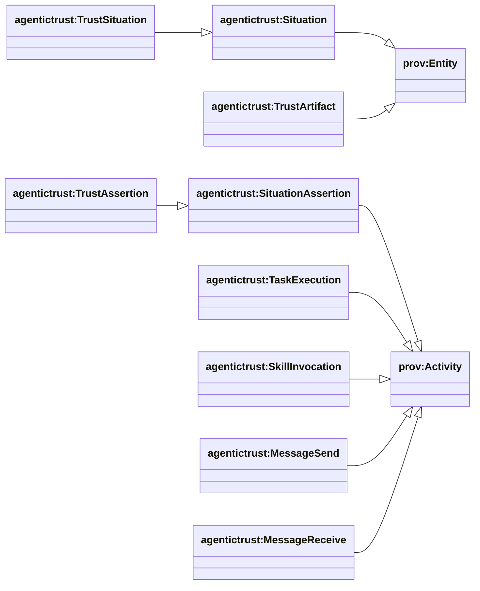
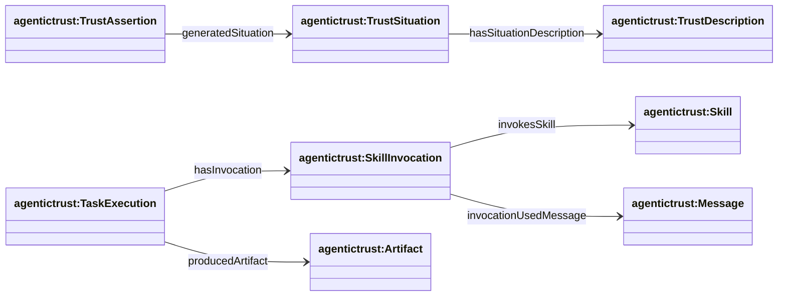

## Situation layer (DnS) — how trust + work happens

Ontology: `agentictrust-core.owl`

In this ontology, **Situation is not an event**.

- `agentictrust:Situation` (and `agentictrust:TrustSituation`) is a **prov:Entity**: an epistemic/social object (“what is being claimed to hold”).
- `agentictrust:SituationAssertion` (and `agentictrust:TrustAssertion`) is a **prov:Activity**: the time-scoped act of asserting a situation.
- Execution/work still “happens” in PROV Activities like `TaskExecution`, `SkillInvocation`, `MessageSend`, etc.

### Class hierarchy (key)



### Relationship diagram (properties)



### SPARQL Queries (demonstrating property relationships)

**Query TrustAssertion (activity) with TrustDescription and asserted TrustSituation (entity):**
```sparql
PREFIX agentictrust: <https://www.agentictrust.io/ontology/agentictrust-core#>

SELECT ?trustAssertion ?trustSituation ?trustDescription
WHERE {
  ?trustAssertion a agentictrust:TrustAssertion .
  
  OPTIONAL {
    ?trustAssertion agentictrust:generatedSituation ?trustSituation .
  }
  OPTIONAL {
    ?trustSituation agentictrust:hasSituationDescription ?trustDescription .
  }
}
```

**Query TaskExecution with SkillInvocation and Skill:**
```sparql
PREFIX agentictrust: <https://www.agentictrust.io/ontology/agentictrust-core#>

SELECT ?taskExecution ?skillInvocation ?skill ?message ?artifact
WHERE {
  ?taskExecution a agentictrust:TaskExecution .
  
  OPTIONAL {
    ?taskExecution agentictrust:hasInvocation ?skillInvocation .
    ?skillInvocation agentictrust:invokesSkill ?skill .
    ?skillInvocation agentictrust:invocationUsedMessage ?message .
  }
  OPTIONAL {
    ?taskExecution agentictrust:producedArtifact ?artifact .
  }
}
```

### Diagrams (how Situation is used)

#### Situation → Trust establishment (verification, reputation, relationships)


#### Situation → Work execution (intent → discovery → invocation → tasks → outcomes)


### What a TrustSituation is (in this ontology)

- **Class**: `agentictrust:TrustSituation`
- **Meaning**: a time-scoped realization of a trust description/plan that can use evidence and produce durable outputs.

### Used to establish trust (registry-aligned)

Situations generate assertions that become the durable “ledger” of trust signals:

- **Verification**: ERC-8004 validation (e.g., `erc8004:ValidationRequest` → `erc8004:ValidationResponse`)
- **Reputation**: ERC-8004 feedback (e.g., `erc8004:Feedback`)
- **Relationships**: ERC-8092 relationship assertions (e.g., `erc8092:RelationshipAssertionERC8092`)

### Used to perform agent work (protocol-aligned)

Situations also cover operational agent work:

- a **message** carries an **intent**
- skills are discovered via **intent type / task type** compatibility
- an agent performs a **SkillInvocation**
- invocations are part of a **TaskExecution**
- tasks produce **Artifacts** (which can include attestations, reports, or trust assertions depending on workflow)

Key links (high level):

- **Message → Intent**: `agentictrust:hasIntent`
- **Skill → IntentType**: `agentictrust:supportsIntentType`
- **IntentType → TaskType**: `agentictrust:mapsToTaskType`
- **Skill → TaskType**: `agentictrust:enablesTaskType`
- **TaskExecution → SkillInvocation**: `agentictrust:hasInvocation`
- **SkillInvocation → Skill**: `agentictrust:invokesSkill`
- **SkillInvocation → Message**: `agentictrust:invocationUsedMessage`
- **TaskExecution → Artifact**: `agentictrust:producedArtifact`


