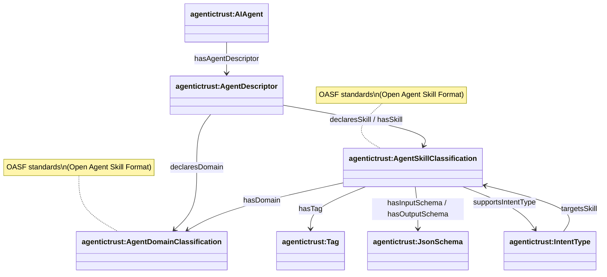
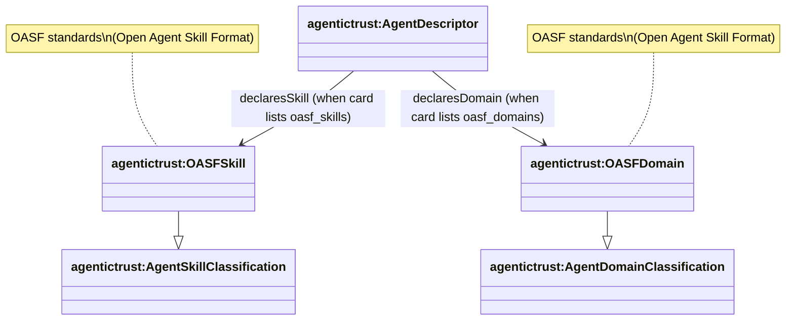

# Skills and Domains (OASF-aligned)

This document is the **deep dive** on how Agent Skill Classifications and Agent Domain Classifications are modeled, how they connect to Descriptors for discovery, and how we align with OASF (Open Agent Skill Format) standards.

Source ontology: `apps/badge-admin/public/ontology/agentictrust-core.owl`

## Core model

### Key classes

- **`agentictrust:AgentDescriptor`**: resolver-produced description used for discovery.
- **`agentictrust:AgentSkillClassification`**: a capability/tool classification used in discovery and routing. Follows OASF (Open Agent Skill Format) standards for skill classification.
- **`agentictrust:AgentDomainClassification`**: categorization classification used for discovery filtering. Follows OASF standards for domain classification.
- **`agentictrust:OASFSkill` / `agentictrust:OASFDomain`**: OASF-synced skill/domain classifications (vocabulary instances).

### Key relationships

- **Skill classification declaration on descriptors**
  - `agentictrust:AgentDescriptor` → `agentictrust:declaresSkill` → `agentictrust:AgentSkillClassification`
  - `agentictrust:Descriptor` → `agentictrust:hasSkill` → `agentictrust:AgentSkillClassification`

- **Domain classification association**
  - `agentictrust:AgentSkillClassification` → `agentictrust:hasDomain` → `agentictrust:AgentDomainClassification`
  - `agentictrust:AgentDescriptor` → `agentictrust:declaresDomain` → `agentictrust:AgentDomainClassification` *(direct domain tagging)*
  - `agentictrust:Descriptor` → `agentictrust:hasDomain` → `agentictrust:AgentDomainClassification`

### Diagram: Agent Skill Classifications + Agent Domain Classifications inside discovery descriptors



## OASF alignment

OASF provides a standardized, GitHub-hosted vocabulary for **domains** and **skills** (and other “dictionary” concepts).

- **Domains**: [`agntcy/oasf/schema/domains`](https://github.com/agntcy/oasf/tree/main/schema/domains)
- **Skills**: [`agntcy/oasf/schema/skills`](https://github.com/agntcy/oasf/tree/main/schema/skills)
- **Domain categories**: [`agntcy/oasf/schema/domain_categories.json`](https://raw.githubusercontent.com/agntcy/oasf/main/schema/domain_categories.json)

### How we key OASF records

- **Hierarchical IDs** are the **path** under:
  - `schema/domains/<category>/<domain>.json` → domain id: `<category>/<domain>`
  - `schema/skills/<category>/.../<skill>.json` → skill id: `<category>/.../<skill>`

### How we set “category”

For both domains and skills, the DB “category” (and `extendsKey`) is derived from `githubPath`:

- `schema/domains/energy/energy_management.json` → category `energy`
- `schema/skills/agent_orchestration/agent_orchestration.json` → category `agent_orchestration`

### Diagram: OASF vocabulary → AgenticTrust discovery nodes



## SPARQL: Agent Skill Classifications (with related info)

### Query: Agent Skill Classifications declared by AgentDescriptors (with tags/domains/schemas/intents)

```sparql
PREFIX agentictrust: <https://www.agentictrust.io/ontology/agentictrust-core#>
PREFIX prov: <http://www.w3.org/ns/prov#>
PREFIX rdfs: <http://www.w3.org/2000/01/rdf-schema#>
PREFIX dcterms: <http://purl.org/dc/terms/>

SELECT DISTINCT
  ?agent ?agentId
  ?descriptor
  ?skill ?skillType ?skillId ?skillLabel ?skillDescription
  ?domain ?domainLabel
  ?tag
  ?inputSchema ?outputSchema
  ?intentType
WHERE {
  ?agent a agentictrust:AIAgent ;
         agentictrust:agentId ?agentId ;
         agentictrust:hasAgentDescriptor ?descriptor .

  {
    ?descriptor agentictrust:declaresSkill ?skill .
  }
  UNION
  {
    ?descriptor agentictrust:hasSkill ?skill .
  }

  OPTIONAL { ?skill a ?skillType . }
  OPTIONAL { ?skill agentictrust:oasfSkillId ?skillId . }
  OPTIONAL { ?skill rdfs:label ?skillLabel . }
  OPTIONAL { ?skill agentictrust:skillName ?skillLabel . }
  OPTIONAL { ?skill dcterms:description ?skillDescription . }
  OPTIONAL { ?skill agentictrust:skillDescription ?skillDescription . }

  OPTIONAL {
    ?skill agentictrust:hasDomain ?domain .
    OPTIONAL { ?domain rdfs:label ?domainLabel . }
    # Domain is now AgentDomainClassification
    FILTER(?domain a agentictrust:AgentDomainClassification)
  }

  OPTIONAL { ?skill agentictrust:hasTag ?tag . }
  OPTIONAL { ?skill agentictrust:hasInputSchema ?inputSchema . }
  OPTIONAL { ?skill agentictrust:hasOutputSchema ?outputSchema . }

  OPTIONAL {
    { ?skill agentictrust:supportsIntentType ?intentType . }
    UNION
    { ?intentType agentictrust:targetsSkill ?skill . }
  }
}
ORDER BY ?agentId ?skillId ?skill
LIMIT 200
```

### Query: OASF-only Agent Skill Classification view (category + GitHub source)

```sparql
PREFIX agentictrust: <https://www.agentictrust.io/ontology/agentictrust-core#>
PREFIX rdfs: <http://www.w3.org/2000/01/rdf-schema#>

SELECT DISTINCT
  ?oasfSkill ?oasfSkillId ?label
  ?extendsKey ?categoryNode
  ?githubPath ?githubSha
WHERE {
  ?oasfSkill a agentictrust:OASFSkill ;
             agentictrust:oasfSkillId ?oasfSkillId .

  OPTIONAL { ?oasfSkill rdfs:label ?label . }
  OPTIONAL { ?oasfSkill agentictrust:oasfExtendsKey ?extendsKey . }
  OPTIONAL { ?oasfSkill agentictrust:oasfCategory ?categoryNode . }
  OPTIONAL { ?oasfSkill agentictrust:githubPath ?githubPath . }
  OPTIONAL { ?oasfSkill agentictrust:githubSha ?githubSha . }
}
ORDER BY ?oasfSkillId
LIMIT 200
```

## SPARQL: Agent Domain Classifications (with related info)

### Query: Agent Domain Classifications only (no joins)

```sparql
PREFIX agentictrust: <https://www.agentictrust.io/ontology/agentictrust-core#>
PREFIX rdfs: <http://www.w3.org/2000/01/rdf-schema#>
PREFIX dcterms: <http://purl.org/dc/terms/>

SELECT DISTINCT
  ?domain ?domainType ?domainId ?label ?description
  ?extendsKey ?categoryNode
  ?githubPath ?githubSha
WHERE {
  ?domain a agentictrust:AgentDomainClassification .
  OPTIONAL { ?domain a ?domainType . }
  OPTIONAL { ?domain agentictrust:oasfDomainId ?domainId . }
  OPTIONAL { ?domain rdfs:label ?label . }
  OPTIONAL { ?domain dcterms:description ?description . }
  OPTIONAL { ?domain rdfs:comment ?description . }
  OPTIONAL { ?domain agentictrust:oasfExtendsKey ?extendsKey . }
  OPTIONAL { ?domain agentictrust:oasfCategory ?categoryNode . }
  OPTIONAL { ?domain agentictrust:githubPath ?githubPath . }
  OPTIONAL { ?domain agentictrust:githubSha ?githubSha . }
}
ORDER BY ?domainId ?domain
LIMIT 200
```

### Query: Agent Domain Classifications declared on AgentDescriptors (and linked skill classifications)

```sparql
PREFIX agentictrust: <https://www.agentictrust.io/ontology/agentictrust-core#>
PREFIX rdfs: <http://www.w3.org/2000/01/rdf-schema#>

SELECT DISTINCT
  ?agent ?agentId
  ?descriptor
  ?domain ?domainType ?domainId ?domainLabel
  ?skill ?skillId
WHERE {
  ?agent a agentictrust:AIAgent ;
         agentictrust:agentId ?agentId ;
         agentictrust:hasAgentDescriptor ?descriptor .

  ?descriptor agentictrust:declaresDomain ?domain .

  OPTIONAL { ?domain a ?domainType . }
  OPTIONAL { ?domain agentictrust:oasfDomainId ?domainId . }
  OPTIONAL { ?domain rdfs:label ?domainLabel . }

  OPTIONAL {
    # Agent Skill Classifications that are connected via hasDomain
    {
      ?descriptor agentictrust:declaresSkill ?skill .
    } UNION {
      ?descriptor agentictrust:hasSkill ?skill .
    }
    ?skill a agentictrust:AgentSkillClassification .
    ?skill agentictrust:hasDomain ?domain .
    OPTIONAL { ?skill agentictrust:oasfSkillId ?skillId . }
  }
}
ORDER BY ?agentId ?domainId ?domain
LIMIT 200
```

### Query: OASF-only Agent Domain Classification view (category + GitHub source)

```sparql
PREFIX agentictrust: <https://www.agentictrust.io/ontology/agentictrust-core#>
PREFIX rdfs: <http://www.w3.org/2000/01/rdf-schema#>

SELECT DISTINCT
  ?oasfDomain ?oasfDomainId ?label
  ?extendsKey ?categoryNode
  ?githubPath ?githubSha
WHERE {
  ?oasfDomain a agentictrust:OASFDomain ;
              agentictrust:oasfDomainId ?oasfDomainId .

  OPTIONAL { ?oasfDomain rdfs:label ?label . }
  OPTIONAL { ?oasfDomain agentictrust:oasfExtendsKey ?extendsKey . }
  OPTIONAL { ?oasfDomain agentictrust:oasfCategory ?categoryNode . }
  OPTIONAL { ?oasfDomain agentictrust:githubPath ?githubPath . }
  OPTIONAL { ?oasfDomain agentictrust:githubSha ?githubSha . }
}
ORDER BY ?oasfDomainId
LIMIT 200
```

## Related diagrams in-repo

If you render diagrams from the Turtle sources, these are directly relevant:

- `docs/ontology/diagrams-src/skills-declarations.ttl`
- `docs/ontology/diagrams-src/oasf-mapping.ttl`


