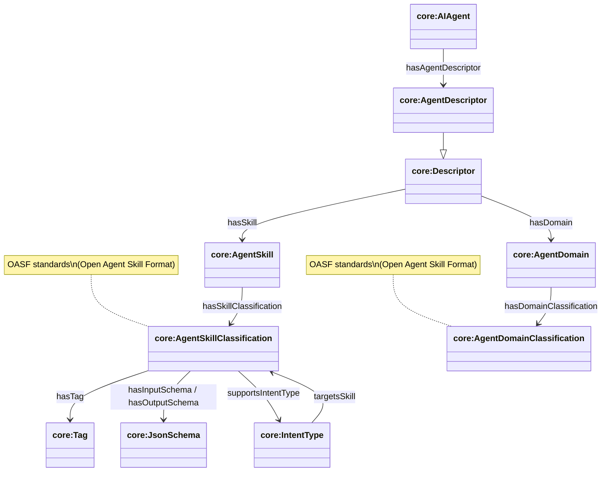
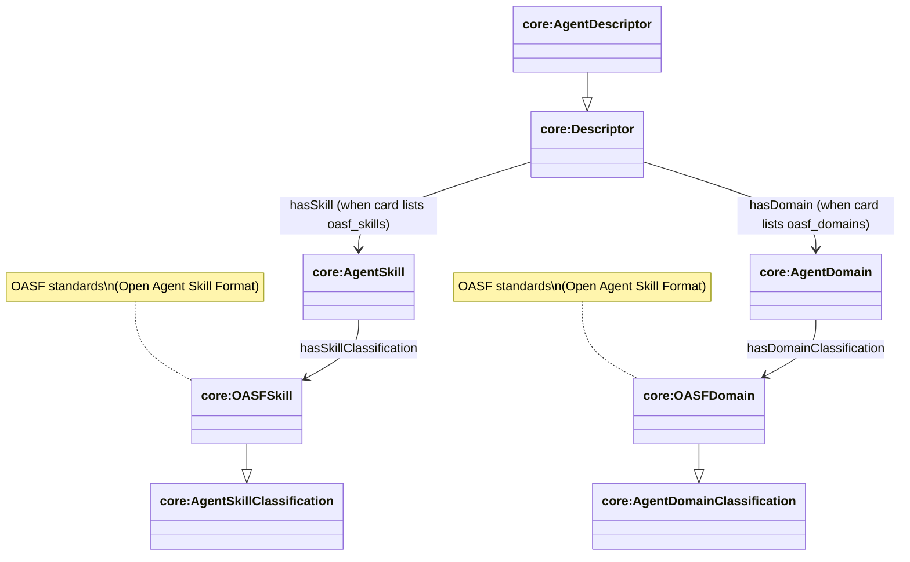

# Skills and Domains (OASF-aligned)

This document is the **deep dive** on how Agent Skill Classifications and Agent Domain Classifications are modeled, how they connect to Descriptors for discovery, and how we align with OASF (Open Agent Skill Format) standards.

Source ontology: `apps/ontology/ontology/core.ttl`

## Core model

### Key classes

- **`core:Descriptor`**: resolver-produced description used for discovery. Base class for all descriptors.
- **`core:AgentDescriptor`**: agent-level descriptor (inherits from `core:Descriptor`).
- **`core:AgentSkill`**: an agent-declared skill instance (part of a Descriptor). Links to its classification.
- **`core:AgentSkillClassification`**: a capability/tool classification used in discovery and routing. Follows OASF (Open Agent Skill Format) standards for skill classification.
- **`core:AgentDomain`**: an agent-declared domain instance (part of a Descriptor). Links to its classification.
- **`core:AgentDomainClassification`**: categorization classification used for discovery filtering. Follows OASF standards for domain classification.
- **`core:OASFSkill` / `core:OASFDomain`**: OASF-synced skill/domain classifications (vocabulary instances).

### Key relationships

- **Skill declaration on descriptors**
  - `core:Descriptor` → `core:hasSkill` → `core:AgentSkill`
  - `core:AgentSkill` → `core:hasSkillClassification` → `core:AgentSkillClassification`
  - `core:AgentDescriptor` inherits `hasSkill` from `core:Descriptor`

- **Domain declaration on descriptors**
  - `core:Descriptor` → `core:hasDomain` → `core:AgentDomain`
  - `core:AgentDomain` → `core:hasDomainClassification` → `core:AgentDomainClassification`
  - `core:AgentDescriptor` inherits `hasDomain` from `core:Descriptor`

### Diagram: Agent Skill Classifications + Agent Domain Classifications inside discovery descriptors



## OASF alignment

OASF provides a standardized, GitHub-hosted vocabulary for **domains** and **skills** (and other “dictionary” concepts).

- **Domains**: [`agntcy/oasf/schema/domains`](https://github.com/agntcy/oasf/tree/main/schema/domains)
- **Skills**: [`agntcy/oasf/schema/skills`](https://github.com/agntcy/oasf/tree/main/schema/skills)
- **Domain categories**: [`agntcy/oasf/schema/domain_categories.json`](https://raw.githubusercontent.com/agntcy/oasf/main/schema/domain_categories.json)

### How we key OASF records

- **Hierarchical IDs** are the **path** under:
  - `schema/domains/<category>/<domain>.json` → domain id: `<category>/<domain>`
  - `schema/skills/<category>/.../<skill>.json` → skill id: `<category>/.../<skill>`

### How we set “category”

For both domains and skills, the DB “category” (and `extendsKey`) is derived from `githubPath`:

- `schema/domains/energy/energy_management.json` → category `energy`
- `schema/skills/agent_orchestration/agent_orchestration.json` → category `agent_orchestration`

### Diagram: OASF vocabulary → AgenticTrust discovery nodes



## How we populate `agents.oasfSkillsJson` and `agents.oasfDomainsJson`

We treat skills/domains as **protocol-derived metadata**. When we ingest agent metadata (via indexer/CLIs), we extract **string skill/domain IDs** from both the ERC-8004 registration JSON (`rawJson`) and (when available) the A2A agent card (`agentCardJson`), then store them in:

- `agents.oasfSkillsJson` (JSON array of strings)
- `agents.oasfDomainsJson` (JSON array of strings)

### Registration JSON (ERC-8004 `rawJson`)

We read OASF-ish arrays from:

- `endpoints[].skills` / `endpoints[].domains`
- `endpoints[].a2aSkills` / `endpoints[].a2aDomains` (app-registered format)
- `endpoints[].oasf_skills` / `endpoints[].oasf_domains`
- root `oasf_skills` / `oasf_domains`

### Agent card JSON (`agentCardJson`)

We extract string skill IDs/domains from:

- `skills[]` if strings
- `skills[]` objects via `.id` (fallback `.name`)
- `capabilities.extensions[].params.skills` / `capabilities.extensions[].params.domains`


## SPARQL: Agent Skill Classifications (with related info)

### Query: Agent Skill Classifications declared by AgentDescriptors (with tags/domains/schemas/intents)

```sparql
PREFIX core: <https://agentictrust.io/ontology/core#>
PREFIX erc8004: <https://agentictrust.io/ontology/erc8004#>
PREFIX xsd: <http://www.w3.org/2001/XMLSchema#>

SELECT DISTINCT
  ?agent ?did8004 (xsd:integer(REPLACE(STR(?did8004), "^did:8004:[0-9]+:", "")) AS ?agentId8004)
  ?descriptor ?serviceUrl
  ?skill
WHERE {
  ?agent a core:AIAgent ;
         core:hasIdentity ?identity8004 .
  ?identity8004 a erc8004:AgentIdentity8004 ;
                core:hasIdentifier ?ident8004 ;
                core:hasDescriptor ?identityDescriptor .
  ?ident8004 core:protocolIdentifier ?did8004 .

  # Skills can appear on:
  # - the ERC-8004 identity descriptor
  # - assembled protocol descriptors (A2A/MCP)
  {
    BIND(?identityDescriptor AS ?descriptor)
  } UNION {
    ?identityDescriptor core:assembledFromMetadata ?descriptor .
    ?descriptor a core:ProtocolDescriptor .
    OPTIONAL { ?descriptor core:serviceUrl ?serviceUrl . }
  }

  ?descriptor core:hasSkill ?skill .
}
ORDER BY ?agentId8004 ?serviceUrl ?skill
LIMIT 200
```

### Query: OASF-only Agent Skill Classification view (category + GitHub source)

```sparql
PREFIX core: <https://agentictrust.io/ontology/core#>
PREFIX rdfs: <http://www.w3.org/2000/01/rdf-schema#>

SELECT DISTINCT
  ?oasfSkill ?oasfSkillId ?label
  ?extendsKey ?categoryNode
  ?githubPath ?githubSha
WHERE {
  ?oasfSkill a core:OASFSkill ;
             core:oasfSkillId ?oasfSkillId .

  OPTIONAL { ?oasfSkill rdfs:label ?label . }
  OPTIONAL { ?oasfSkill core:oasfExtendsKey ?extendsKey . }
  OPTIONAL { ?oasfSkill core:oasfCategory ?categoryNode . }
  OPTIONAL { ?oasfSkill core:githubPath ?githubPath . }
  OPTIONAL { ?oasfSkill core:githubSha ?githubSha . }
}
ORDER BY ?oasfSkillId
LIMIT 200
```

## SPARQL: Agent Domain Classifications (with related info)

### Query: Agent Domain Classifications only (no joins)

```sparql
PREFIX core: <https://agentictrust.io/ontology/core#>
PREFIX rdfs: <http://www.w3.org/2000/01/rdf-schema#>
PREFIX dcterms: <http://purl.org/dc/terms/>

SELECT DISTINCT
  ?domain ?domainType ?domainId ?label ?description
  ?extendsKey ?categoryNode
  ?githubPath ?githubSha
WHERE {
  ?domain a core:AgentDomainClassification .
  OPTIONAL { ?domain a ?domainType . }
  OPTIONAL { ?domain core:oasfDomainId ?domainId . }
  OPTIONAL { ?domain rdfs:label ?label . }
  OPTIONAL { ?domain dcterms:description ?description . }
  OPTIONAL { ?domain rdfs:comment ?description . }
  OPTIONAL { ?domain core:oasfExtendsKey ?extendsKey . }
  OPTIONAL { ?domain core:oasfCategory ?categoryNode . }
  OPTIONAL { ?domain core:githubPath ?githubPath . }
  OPTIONAL { ?domain core:githubSha ?githubSha . }
}
ORDER BY ?domainId ?domain
LIMIT 200
```

### Query: Agent Domain Classifications declared on AgentDescriptors (and linked skill classifications)

```sparql
PREFIX core: <https://agentictrust.io/ontology/core#>
PREFIX erc8004: <https://agentictrust.io/ontology/erc8004#>
PREFIX xsd: <http://www.w3.org/2001/XMLSchema#>

SELECT DISTINCT
  ?agent ?did8004 (xsd:integer(REPLACE(STR(?did8004), "^did:8004:[0-9]+:", "")) AS ?agentId8004)
  ?descriptor ?serviceUrl
  ?domain
WHERE {
  ?agent a core:AIAgent ;
         core:hasIdentity ?identity8004 .
  ?identity8004 a erc8004:AgentIdentity8004 ;
                core:hasIdentifier ?ident8004 ;
                core:hasDescriptor ?identityDescriptor .
  ?ident8004 core:protocolIdentifier ?did8004 .

  {
    BIND(?identityDescriptor AS ?descriptor)
  } UNION {
    ?identityDescriptor core:assembledFromMetadata ?descriptor .
    ?descriptor a core:ProtocolDescriptor .
    OPTIONAL { ?descriptor core:serviceUrl ?serviceUrl . }
  }

  ?descriptor core:hasDomain ?domain .
}
ORDER BY ?agentId8004 ?serviceUrl ?domain
LIMIT 200
```

### Query: OASF-only Agent Domain Classification view (category + GitHub source)

```sparql
PREFIX core: <https://agentictrust.io/ontology/core#>
PREFIX rdfs: <http://www.w3.org/2000/01/rdf-schema#>

SELECT DISTINCT
  ?oasfDomain ?oasfDomainId ?label
  ?extendsKey ?categoryNode
  ?githubPath ?githubSha
WHERE {
  ?oasfDomain a core:OASFDomain ;
              core:oasfDomainId ?oasfDomainId .

  OPTIONAL { ?oasfDomain rdfs:label ?label . }
  OPTIONAL { ?oasfDomain core:oasfExtendsKey ?extendsKey . }
  OPTIONAL { ?oasfDomain core:oasfCategory ?categoryNode . }
  OPTIONAL { ?oasfDomain core:githubPath ?githubPath . }
  OPTIONAL { ?oasfDomain core:githubSha ?githubSha . }
}
ORDER BY ?oasfDomainId
LIMIT 200
```

## Related diagrams in-repo

If you render diagrams from the Turtle sources, these are directly relevant:

- `docs/ontology/diagrams-src/skills-declarations.ttl`
- `docs/ontology/diagrams-src/oasf-mapping.ttl`


