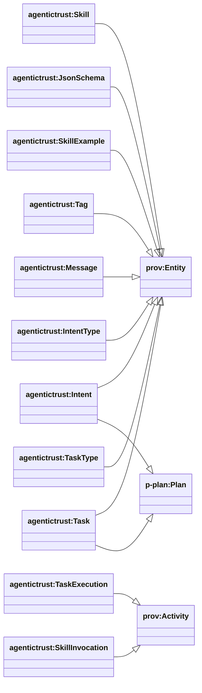
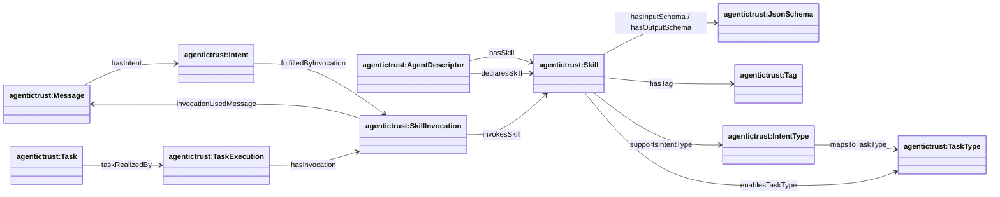

## Skills ↔ intents ↔ tasks (routing + execution)

Ontology: `agentictrust-core.owl` (core)

### Class hierarchy (key)



### Relationship diagram (routing + execution)



### SPARQL Queries (demonstrating property relationships)

**Query AgentDescriptor with Skills (declared and has):**
```sparql
PREFIX agentictrust: <https://www.agentictrust.io/ontology/agentictrust-core#>

SELECT ?agentDescriptor ?skill ?skillLabel
WHERE {
  ?agentDescriptor a agentictrust:AgentDescriptor .
  
  {
    ?agentDescriptor agentictrust:hasSkill ?skill .
  }
  UNION
  {
    ?agentDescriptor agentictrust:declaresSkill ?skill .
  }
  
  OPTIONAL {
    ?skill rdfs:label ?skillLabel .
  }
}
```

**Query Skill with JsonSchema, Tag, IntentType, and TaskType:**
```sparql
PREFIX agentictrust: <https://www.agentictrust.io/ontology/agentictrust-core#>

SELECT ?skill ?skillLabel ?inputSchema ?outputSchema ?tag ?intentType ?taskType
WHERE {
  ?skill a agentictrust:Skill .
  
  OPTIONAL {
    ?skill rdfs:label ?skillLabel .
  }
  OPTIONAL {
    ?skill agentictrust:hasInputSchema ?inputSchema .
  }
  OPTIONAL {
    ?skill agentictrust:hasOutputSchema ?outputSchema .
  }
  OPTIONAL {
    ?skill agentictrust:hasTag ?tag .
  }
  OPTIONAL {
    ?skill agentictrust:supportsIntentType ?intentType .
  }
  OPTIONAL {
    ?skill agentictrust:enablesTaskType ?taskType .
  }
}
```

**Query IntentType to TaskType mapping:**
```sparql
PREFIX agentictrust: <https://www.agentictrust.io/ontology/agentictrust-core#>

SELECT ?intentType ?taskType
WHERE {
  ?intentType a agentictrust:IntentType ;
    agentictrust:mapsToTaskType ?taskType .
}
```

**Query Message with Intent and SkillInvocation:**
```sparql
PREFIX agentictrust: <https://www.agentictrust.io/ontology/agentictrust-core#>

SELECT ?message ?intent ?skillInvocation ?skill
WHERE {
  ?message a agentictrust:Message ;
    agentictrust:hasIntent ?intent .
  
  OPTIONAL {
    ?intent agentictrust:fulfilledByInvocation ?skillInvocation .
    ?skillInvocation agentictrust:invokesSkill ?skill .
  }
}
```

**Query Task with TaskExecution and SkillInvocation:**
```sparql
PREFIX agentictrust: <https://www.agentictrust.io/ontology/agentictrust-core#>

SELECT ?task ?taskExecution ?skillInvocation ?skill ?message
WHERE {
  ?task a agentictrust:Task ;
    agentictrust:taskRealizedBy ?taskExecution .
  
  OPTIONAL {
    ?taskExecution agentictrust:hasInvocation ?skillInvocation .
    ?skillInvocation agentictrust:invokesSkill ?skill .
    ?skillInvocation agentictrust:invocationUsedMessage ?message .
  }
}
```

### Diagrams


### Discovery (cards/metadata)

- `agentictrust:AgentDescriptor` → `agentictrust:Skill`: `agentictrust:hasSkill`
- `agentictrust:AgentDescriptor` → `agentictrust:Skill`: `agentictrust:declaresSkill`

### Skill modeling (tool/function best-practice hooks)

- `agentictrust:Skill` → `agentictrust:JsonSchema`
  - `agentictrust:hasInputSchema`
  - `agentictrust:hasOutputSchema`
- `agentictrust:Skill` → `agentictrust:SkillExample`: `agentictrust:hasExample`
- `agentictrust:Skill` → `agentictrust:Tag`: `agentictrust:hasTag`

### Routing (intent types and task types)

- `agentictrust:Skill` → `agentictrust:IntentType`: `agentictrust:supportsIntentType`
- `agentictrust:IntentType` → `agentictrust:TaskType`: `agentictrust:mapsToTaskType`
- `agentictrust:Skill` → `agentictrust:TaskType`: `agentictrust:enablesTaskType`
- `agentictrust:TaskType` → `agentictrust:Skill`: `agentictrust:implementedBySkill`

### Execution trace

- `agentictrust:Task` → `agentictrust:TaskExecution`: `agentictrust:taskRealizedBy`
- `agentictrust:TaskExecution` → `agentictrust:SkillInvocation`: `agentictrust:hasInvocation`
- `agentictrust:SkillInvocation` → `agentictrust:Skill`: `agentictrust:invokesSkill`
- `agentictrust:SkillInvocation` → `agentictrust:Message`: `agentictrust:invocationUsedMessage`
- `agentictrust:Intent` → `agentictrust:SkillInvocation`: `agentictrust:fulfilledByInvocation`


