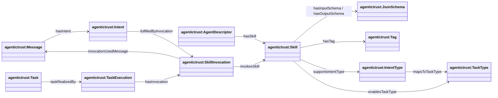

## Skills ↔ intents ↔ tasks (routing + execution)

Ontology: `agentictrust.owl` (core)

### Class hierarchy (key)

### Relationship diagram (routing + execution)

### Diagrams

### Discovery (cards/metadata)

- `agentictrust:AgentDescriptor` → `agentictrust:Skill`: `agentictrust:hasSkill`
- `agentictrust:AgentMetadata` → `agentictrust:Skill`: `agentictrust:declaresSkill`

### Skill modeling (tool/function best-practice hooks)

- `agentictrust:Skill` → `agentictrust:JsonSchema`
  - `agentictrust:hasInputSchema`
  - `agentictrust:hasOutputSchema`
- `agentictrust:Skill` → `agentictrust:SkillExample`: `agentictrust:hasExample`
- `agentictrust:Skill` → `agentictrust:Tag`: `agentictrust:hasTag`

### Routing (intent types and task types)

- `agentictrust:Skill` → `agentictrust:IntentType`: `agentictrust:supportsIntentType`
- `agentictrust:IntentType` → `agentictrust:TaskType`: `agentictrust:mapsToTaskType`
- `agentictrust:Skill` → `agentictrust:TaskType`: `agentictrust:enablesTaskType`
- `agentictrust:TaskType` → `agentictrust:Skill`: `agentictrust:implementedBySkill`

### Execution trace

- `agentictrust:Task` → `agentictrust:TaskExecution`: `agentictrust:taskRealizedBy`
- `agentictrust:TaskExecution` → `agentictrust:SkillInvocation`: `agentictrust:hasInvocation`
- `agentictrust:SkillInvocation` → `agentictrust:Skill`: `agentictrust:invokesSkill`
- `agentictrust:SkillInvocation` → `agentictrust:Message`: `agentictrust:invocationUsedMessage`
- `agentictrust:Intent` → `agentictrust:SkillInvocation`: `agentictrust:fulfilledByInvocation`

