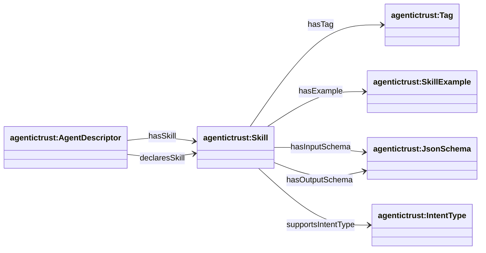
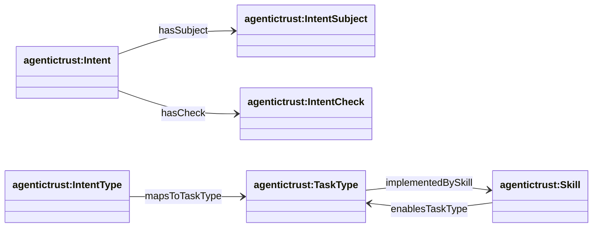
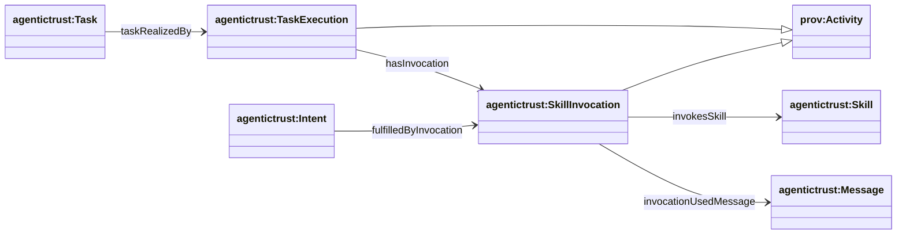

## Skills / tools / intents / tasks (`agentictrust-core.owl`)

Source: `apps/badge-admin/public/ontology/agentictrust-core.owl`

### Overview

The ontology separates:

- **Discovery**: metadata/card declarations about skills
- **Routing**: intent types and task types
- **Execution trace**: skill invocations used to realize tasks/fulfill intents

### Skills and declarations



### Intents, task types, and mappings



### Execution trace (activities)



## SPARQL Queries

### Query: AgentDescriptor with Skills

```sparql
PREFIX agentictrust: <https://www.agentictrust.io/ontology/agentictrust-core#>
PREFIX rdfs: <http://www.w3.org/2000/01/rdf-schema#>

SELECT ?agentDescriptor ?skill ?skillLabel
WHERE {
  ?agentDescriptor a agentictrust:AgentDescriptor .
  
  {
    ?agentDescriptor agentictrust:hasSkill ?skill .
  }
  UNION
  {
    ?agentDescriptor agentictrust:declaresSkill ?skill .
  }
  
  OPTIONAL {
    ?skill rdfs:label ?skillLabel .
  }
}
ORDER BY ?agentDescriptor ?skill
```

### Query: Skill with JsonSchema, Tag, and IntentType

```sparql
PREFIX agentictrust: <https://www.agentictrust.io/ontology/agentictrust-core#>
PREFIX rdfs: <http://www.w3.org/2000/01/rdf-schema#>

SELECT ?skill ?skillLabel ?inputSchema ?outputSchema ?tag ?intentType
WHERE {
  ?skill a agentictrust:Skill .
  
  OPTIONAL {
    ?skill rdfs:label ?skillLabel .
  }
  
  OPTIONAL {
    ?skill agentictrust:hasInputSchema ?inputSchema .
    ?inputSchema a agentictrust:JsonSchema .
  }
  
  OPTIONAL {
    ?skill agentictrust:hasOutputSchema ?outputSchema .
    ?outputSchema a agentictrust:JsonSchema .
  }
  
  OPTIONAL {
    ?skill agentictrust:hasTag ?tag .
    ?tag a agentictrust:Tag .
  }
  
  OPTIONAL {
    ?skill agentictrust:supportsIntentType ?intentType .
    ?intentType a agentictrust:IntentType .
  }
}
LIMIT 100
```

### Query: Skill with TaskType

```sparql
PREFIX agentictrust: <https://www.agentictrust.io/ontology/agentictrust-core#>
PREFIX rdfs: <http://www.w3.org/2000/01/rdf-schema#>

SELECT ?skill ?skillLabel ?taskType ?taskTypeLabel
WHERE {
  ?skill a agentictrust:Skill .
  
  OPTIONAL {
    ?skill rdfs:label ?skillLabel .
  }
  
  OPTIONAL {
    ?skill agentictrust:enablesTaskType ?taskType .
    ?taskType a agentictrust:TaskType .
    
    OPTIONAL {
      ?taskType rdfs:label ?taskTypeLabel .
    }
  }
}
LIMIT 100
```

### Query: IntentType to TaskType Mapping

```sparql
PREFIX agentictrust: <https://www.agentictrust.io/ontology/agentictrust-core#>
PREFIX rdfs: <http://www.w3.org/2000/01/rdf-schema#>

SELECT ?intentType ?intentTypeLabel ?taskType ?taskTypeLabel
WHERE {
  ?intentType a agentictrust:IntentType .
  
  OPTIONAL {
    ?intentType rdfs:label ?intentTypeLabel .
  }
  
  OPTIONAL {
    ?intentType agentictrust:mapsToTaskType ?taskType .
    ?taskType a agentictrust:TaskType .
    
    OPTIONAL {
      ?taskType rdfs:label ?taskTypeLabel .
    }
  }
}
ORDER BY ?intentType
```

### Query: Message with Intent and SkillInvocation

```sparql
PREFIX agentictrust: <https://www.agentictrust.io/ontology/agentictrust-core#>
PREFIX prov: <http://www.w3.org/ns/prov#>

SELECT ?message ?intent ?skillInvocation ?skill
WHERE {
  ?message a agentictrust:Message .
  
  OPTIONAL {
    ?message agentictrust:hasIntent ?intent .
    ?intent a agentictrust:Intent .
    
    OPTIONAL {
      ?intent agentictrust:fulfilledByInvocation ?skillInvocation .
      ?skillInvocation a agentictrust:SkillInvocation .
      
      OPTIONAL {
        ?skillInvocation agentictrust:invokesSkill ?skill .
        ?skill a agentictrust:Skill .
      }
    }
  }
}
LIMIT 50
```

### Query: Task with TaskExecution and SkillInvocation

```sparql
PREFIX agentictrust: <https://www.agentictrust.io/ontology/agentictrust-core#>
PREFIX prov: <http://www.w3.org/ns/prov#>

SELECT ?task ?taskExecution ?skillInvocation ?skill ?message
WHERE {
  ?task a agentictrust:Task .
  
  OPTIONAL {
    ?task agentictrust:taskRealizedBy ?taskExecution .
    ?taskExecution a agentictrust:TaskExecution .
    
    OPTIONAL {
      ?taskExecution agentictrust:hasInvocation ?skillInvocation .
      ?skillInvocation a agentictrust:SkillInvocation .
      
      OPTIONAL {
        ?skillInvocation agentictrust:invokesSkill ?skill .
        ?skill a agentictrust:Skill .
      }
      
      OPTIONAL {
        ?skillInvocation agentictrust:invocationUsedMessage ?message .
        ?message a agentictrust:Message .
      }
    }
  }
}
LIMIT 50
```

### Query: Complete Skill Discovery Chain

This query shows the complete chain from AgentDescriptor through Skills to their schemas, tags, and intent types:

```sparql
PREFIX agentictrust: <https://www.agentictrust.io/ontology/agentictrust-core#>
PREFIX agentictrustEth: <https://www.agentictrust.io/ontology/agentictrust-eth#>
PREFIX rdfs: <http://www.w3.org/2000/01/rdf-schema#>

SELECT ?agent ?agentId ?agentDescriptor ?skill ?skillLabel 
       ?inputSchema ?outputSchema ?tag ?intentType ?taskType
WHERE {
  ?agent a agentictrust:AIAgent ;
    agentictrust:agentId ?agentId ;
    agentictrust:hasAgentDescriptor ?agentDescriptor .
  
  ?agentDescriptor a agentictrust:AgentDescriptor .
  
  {
    ?agentDescriptor agentictrust:hasSkill ?skill .
  }
  UNION
  {
    ?agentDescriptor agentictrust:declaresSkill ?skill .
  }
  
  ?skill a agentictrust:Skill .
  
  OPTIONAL {
    ?skill rdfs:label ?skillLabel .
  }
  
  OPTIONAL {
    ?skill agentictrust:hasInputSchema ?inputSchema .
  }
  
  OPTIONAL {
    ?skill agentictrust:hasOutputSchema ?outputSchema .
  }
  
  OPTIONAL {
    ?skill agentictrust:hasTag ?tag .
  }
  
  OPTIONAL {
    ?skill agentictrust:supportsIntentType ?intentType .
    
    OPTIONAL {
      ?intentType agentictrust:mapsToTaskType ?taskType .
    }
  }
}
LIMIT 100
```


