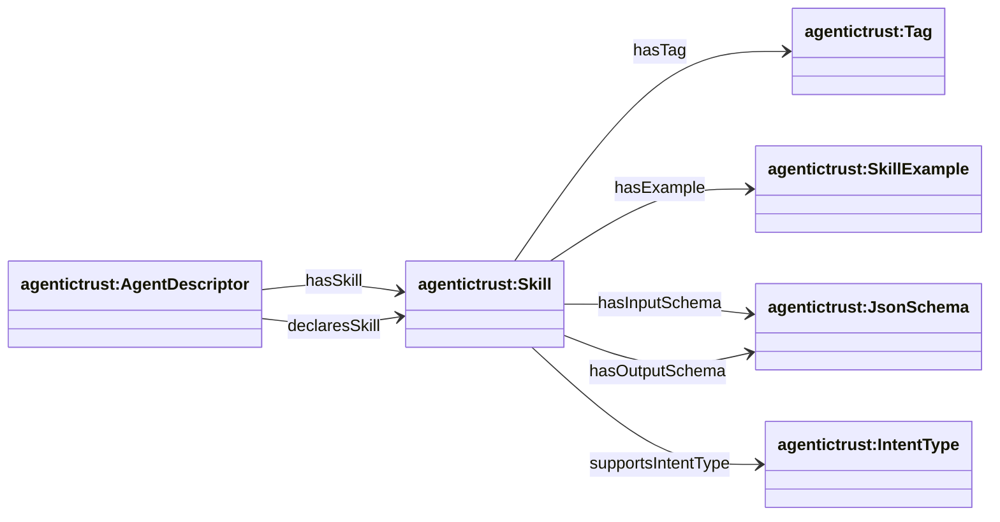
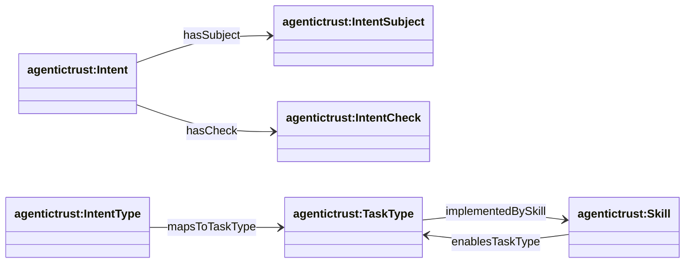
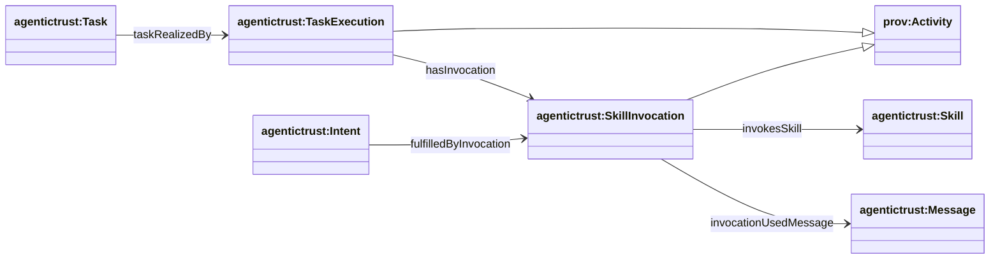

## Skills / tools / intents / tasks (`agentictrust.owl`)

Source: `apps/badge-admin/public/ontology/agentictrust.owl`

### Overview

The ontology separates:

- **Discovery**: metadata/card declarations about skills
- **Routing**: intent types and task types
- **Execution trace**: skill invocations used to realize tasks/fulfill intents

### Skills and declarations

### Intents, task types, and mappings

### Execution trace (activities)

