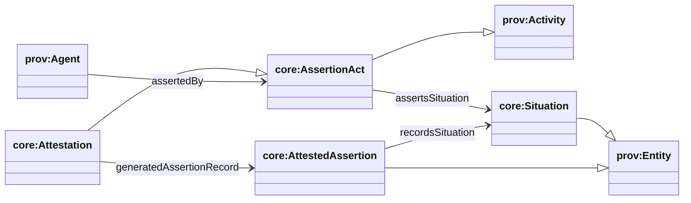
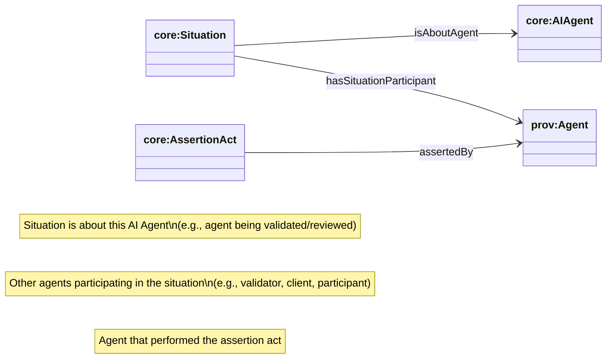
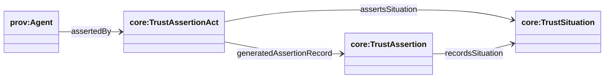

## Trust graph (Situations + Assertions over PROV)

This page describes the **trust graph** patterns as an epistemic overlay grounded in **PROV-O**:

- **Situation** (`core:Situation`) is a **prov:Entity** (a context / framing).
- **AssertionAct** (`core:AssertionAct`) is a **prov:Activity** (generic superclass for assertion-like acts).
- **Attestation** (`core:Attestation`) is a **prov:Activity** (accountable assertion act; prov:used `Assertion` and prov:generated an `AttestedAssertion`).
- **AttestedAssertion** (`core:AttestedAssertion`) is a **prov:Entity** (durable record/artifact generated by an Attestation).
- Many assertion acts and records can exist for the same situation (multiple validators, feedback providers, endorsers).

### High-level abstraction (PROV grounding)



### Situation (context) — abstract relationships to Agents



**SPARQL: situations and their about agents**

```sparql
PREFIX core: <https://core.io/ontology/core#>

SELECT ?situation ?situationType ?aboutAgent ?agentId
WHERE {
  ?situation a ?situationType .
  ?situationType rdfs:subClassOf* core:Situation .
  ?situation core:isAboutAgent ?aboutAgent .
  OPTIONAL {
    ?aboutAgent a core:AIAgent ;
      core:agentId ?agentId .
  }
}
ORDER BY ?agentId ?situationType
LIMIT 200
```

**SPARQL: situations and their participants**

```sparql
PREFIX core: <https://core.io/ontology/core#>

SELECT ?situation ?participant ?participantType
WHERE {
  ?situation a core:Situation .
  ?situation core:hasSituationParticipant ?participant .
  OPTIONAL { ?participant a ?participantType . }
}
ORDER BY ?situation ?participant
LIMIT 200
```

**SPARQL: assertion acts and their asserting agents**

```sparql
PREFIX core: <https://core.io/ontology/core#>

SELECT ?assertionAct ?assertingAgent ?situation
WHERE {
  ?assertionAct a core:Attestation .
  ?assertionAct core:assertedBy ?assertingAgent .
  OPTIONAL { ?assertionAct core:assertsSituation ?situation . }
}
ORDER BY ?assertingAgent ?situation
LIMIT 200
```

### Trust specializations (what trust cares about)

Trust is modeled as specialization on the **Situation side** (TrustSituation types) and specialization on the **Assertion side** (TrustAssertion types):

- **Trust situations**:
  - `core:VerificationRequestSituation` (request for validation)
  - `core:ReputationTrustSituation` (reputation context)
  - `core:RelationshipTrustSituation` (relationship context)
- **Trust assertion records** (prov:Entity):
  - `core:VerificationTrustAssertion` (validation response record)
  - `core:ReputationTrustAssertion` (feedback record)
  - `core:RelationshipTrustAssertion` (relationship assertion record)
- **Trust assertion acts** (prov:Activity):
  - `core:VerificationTrustAssertionAct` (act of validating)
  - `core:ReputationTrustAssertionAct` (act of providing feedback)
  - `core:RelationshipTrustAssertionAct` (act of asserting relationship)

### Example: many assertions for the same situation



**SPARQL: count assertion records per situation**

```sparql
PREFIX core: <https://core.io/ontology/core#>

SELECT ?situation (COUNT(?assertionRecord) AS ?assertionCount)
WHERE {
  ?assertionRecord a core:TrustAssertion ;
    core:recordsSituation ?situation .
}
GROUP BY ?situation
ORDER BY DESC(?assertionCount)
LIMIT 200
```

**SPARQL: count assertion acts per situation**

```sparql
PREFIX core: <https://core.io/ontology/core#>

SELECT ?situation (COUNT(?assertionAct) AS ?actCount)
WHERE {
  ?assertionAct a core:TrustAssertionAct ;
    core:assertsSituation ?situation .
}
GROUP BY ?situation
ORDER BY DESC(?actCount)
LIMIT 200
```


