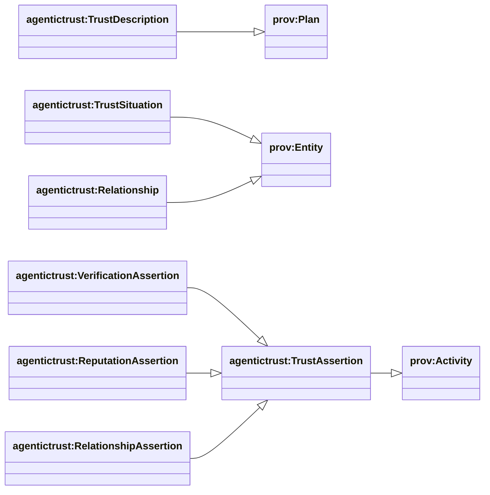
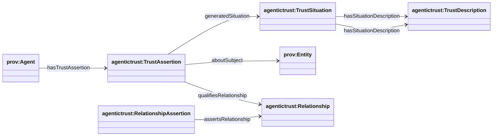
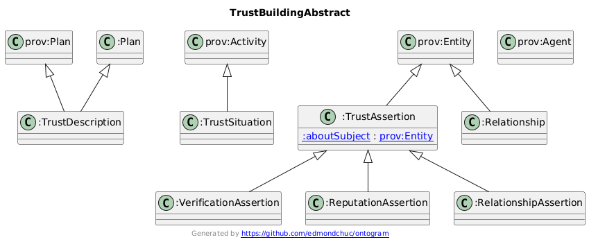
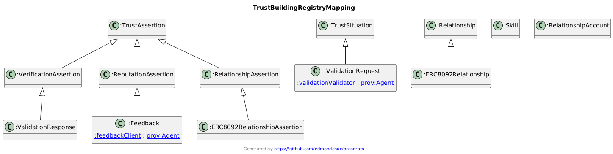

## Trust building (trust graph overlay)

This page focuses on **trust building**: how the AgenticTrust ontology expresses the *trust graph* patterns and how ERC registries attach concrete records to those patterns.

### Class hierarchy (key)

### Relationship diagram (trust graph overlay)

### Diagram: abstract trust graph overlay

Interpretation:

- A **TrustDescription** (“Trust plan”) expresses *what* should be trusted and *why* (roles/constraints/outcomes).
- A **TrustSituation** (“trust event”) is a time-scoped occurrence that **realizes** a description.
- A situation **uses evidence** and is **associated with agents** (who executed/validated).
- The situation **generates** durable **TrustAssertions** (claims you can cite, score, and link).
- Assertions can:
  - be **about** a subject (`aboutSubject`)
  - **qualify** an existing relationship (`qualifiesRelationship`)
  - or **assert**/constitute a relationship (`assertsRelationship`)

### Diagram: mapping to ERC registries (ERC-8004 + ERC-8092)

How to read this:

- **ERC-8004 validation registry**
  - `erc8004:ValidationRequest` is modeled as a **TrustSituation**
  - `erc8004:ValidationResponse` is modeled as a **VerificationAssertion** (durable claim / on-chain record)
  - the validator is captured via `erc8004:validationValidator` (and optionally links to a known agent identity in data)

- **ERC-8004 reputation registry**
  - `erc8004:Feedback` is modeled as a **ReputationAssertion**
  - links like `erc8004:feedbackClient` and `erc8004:feedbackSkill` express who provided feedback and for which capability

- **ERC-8092 associated accounts storage**
  - `erc8092:RelationshipAssertionERC8092` is modeled as a **RelationshipAssertion** (on-chain relationship record)
  - the relationship instance is `erc8092:RelationshipERC8092`
  - participant accounts are captured via `erc8092:initiatorAccount` / `erc8092:approverAccount`

### Practical “trust building” query patterns

This normalized overlay makes it possible to query trust across registries with a shared shape:

- **Verification**: “show validations about this agent/endpoint”
- **Reputation**: “show feedback and responses for this agent/skill”
- **Relationships**: “show relationship assertions connecting these identities/accounts”

