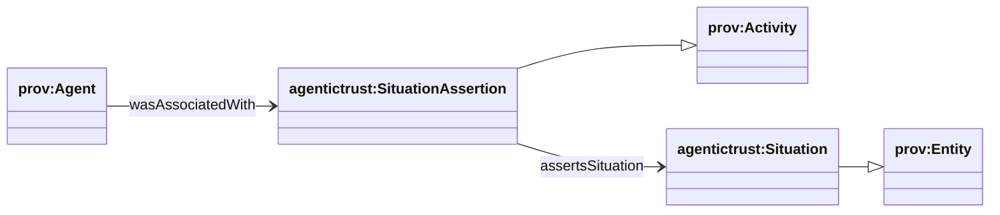
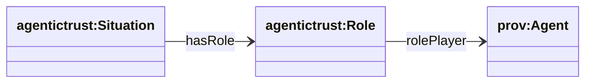
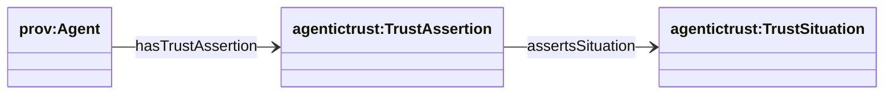

## Trust graph (Situations + Assertions over PROV)

This page describes the **trust graph** patterns as an epistemic overlay grounded in **PROV-O**:

- **Situation** (`agentictrust:Situation`) is a **prov:Entity** (a context / framing).
- **Assertion** (`agentictrust:SituationAssertion`) is a **prov:Activity** (an act that asserts a situation).
- Many assertions can exist for the same situation (multiple validators, feedback providers, endorsers).

### High-level abstraction (PROV grounding)



### Situation (context) — roles and participation



**SPARQL: roles + role players for situations**

```sparql
PREFIX agentictrust: <https://www.agentictrust.io/ontology/agentictrust-core#>

SELECT ?situation ?role ?agent
WHERE {
  ?situation agentictrust:hasRole ?role .
  OPTIONAL { ?role agentictrust:rolePlayer ?agent . }
}
LIMIT 200
```

### Trust specializations (what trust cares about)

Trust is modeled as specialization on the **Situation side** (TrustSituation types) and specialization on the **Assertion side** (TrustAssertion types):

- **Trust situations**:
  - `agentictrust:VerificationTrustSituation`
  - `agentictrust:ReputationTrustSituation`
  - `agentictrust:RelationshipTrustSituation`
- **Trust assertions**:
  - `agentictrust:VerificationTrustAssertion`
  - `agentictrust:ReputationTrustAssertion`

### Example: many assertions for the same situation



**SPARQL: count assertions per situation**

```sparql
PREFIX agentictrust: <https://www.agentictrust.io/ontology/agentictrust-core#>

SELECT ?situation (COUNT(?assertion) AS ?assertionCount)
WHERE {
  ?assertion a agentictrust:TrustAssertion ;
    agentictrust:assertsSituation ?situation .
}
GROUP BY ?situation
ORDER BY DESC(?assertionCount)
LIMIT 200
```


