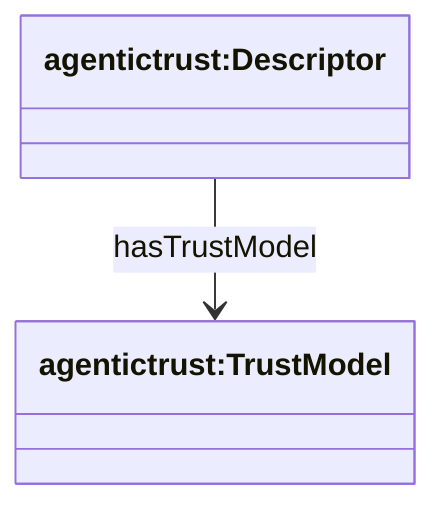

# Trust Model taxonomy

ERC-8004 registration JSON (from `tokenUri`) can advertise **trust models**—the broad reason confidence exists (how trust is grounded), not the specific evidence artifact.

In particular, a **Trust Execution Environment (TEE)** is modeled as **`execution-integrity`**: confidence comes from **how/where execution occurred** (attestation/proof), not only who performed it or historical reputation.

### Core classes and relationships

### Canonical TrustModel categories

These are the canonical, non-overlapping categories (instances of `agentictrust:TrustModel`):

- **execution-integrity** (TEE / verifiable execution)
- **reputation**
- **crypto-economic**
- **social-graph**
- **authority-institutional**
- **identity-assurance**
- **process-conformance**
- **data-provenance**
- **consensus-quorum**
- **contextual-situational**

