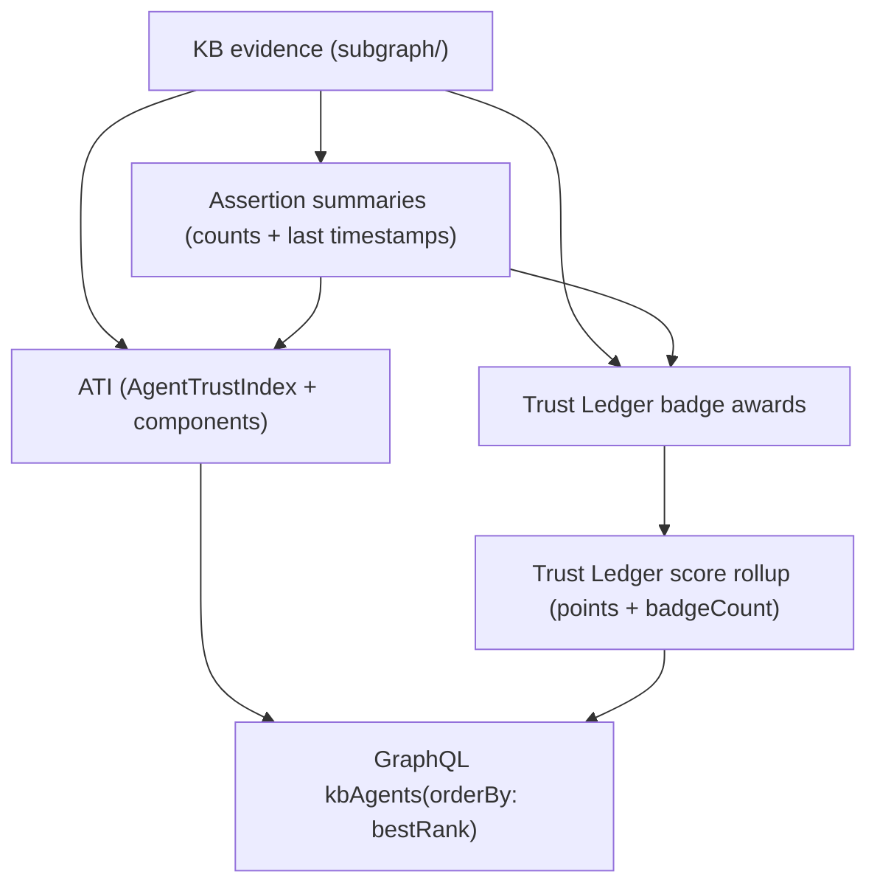

# Trust scoring, badges, and ranking strategy (ATI + Trust Ledger)

This document explains the overall strategy for **agent trust analytics** in the Knowledge Base (GraphDB): how we compute **scores**, **trust index**, **badges**, and how those outputs drive **ranking** (e.g. admin leaderboard).

If you want the command-level “what gets written where” reference, see [`sync-analytics-jobs.md`](./sync-analytics-jobs.md).

## Terms

- **Evidence**: On-chain / ingested facts in the KB (agents, identities, feedback, validations, associations, revocations, descriptors, agent cards, etc.).
- **Materialized aggregates**: Precomputed rollups written into the KB to make reads fast (avoid expensive `COUNT()` at query-time).
- **Trust Ledger**: A **points + badges** program: it outputs badge awards and a points rollup per agent.
- **ATI (Agent Trust Index)**: A **0..100 index** intended to be explainable (with component breakdown + confidence).
- **Rank**: A deterministic ordering for “top agents” views. In GraphQL we expose this as `orderBy: bestRank`.

## Why we have both Trust Ledger and ATI

They play different roles:

- **Trust Ledger score (points)** answers: *“Has this agent accumulated trust-related achievements?”*
  - Very legible for users and incentives (badges + points).
  - Easy to interpret and debug (each badge has an evidence trail).

- **ATI (trust index)** answers: *“How complete/credible/current is this agent’s presence in the KB?”*
  - More “holistic signal”: identity + descriptors + endpoints + experience + freshness, etc.
  - Designed to be explainable via components and an overall confidence number.

In practice:
- Trust Ledger is great for **achievement-based** ranking.
- ATI is great for **quality/completeness** ranking and tie-breaking.

## Strategy: materialize to GraphDB, query from GraphQL

We compute analytics in `apps/sync` and write them into GraphDB named graphs so GraphQL reads are fast and stable.

## “Score” vs “Index”

### Trust Ledger score (points)

**What it is**: integer points computed from awarded badges.

**What it’s for**:
- Leaderboard ordering (primary “who is most trusted” metric).
- UI display (“this agent earned X points and Y badges”).

**Shape in GraphDB** (analytics graph):
- `analytics:AgentTrustLedgerScore`
  - `analytics:totalPoints` (int)
  - `analytics:badgeCount` (int)
  - `analytics:trustLedgerComputedAt` (unix seconds)

### ATI trust index (0..100)

**What it is**: a computed index (0..100) plus confidence and a component breakdown.

**What it’s for**:
- Sorting/tie-breaker when Trust Ledger points are equal or missing.
- Debug/explain via `bundleJson` + per-component records.

**Shape in GraphDB** (analytics graph):
- `analytics:AgentTrustIndex`
  - `analytics:overallScore` (int 0..100)
  - `analytics:overallConfidence` (decimal 0..1)
  - `analytics:computedAt` (unix seconds)
  - `analytics:version` (string)
- `analytics:AgentTrustComponent`
  - `analytics:component`, `analytics:score`, `analytics:weight`, `analytics:evidenceCountsJson`

## Badges and awards

Badges exist at two layers:

1) **Badge definitions (catalog)** — global list of what badges exist and how they’re described:
   - Class: `analytics:TrustLedgerBadgeDefinition`
   - Stored in: `.../analytics/system`

2) **Badge awards (per agent)** — what an agent actually earned:
   - Class: `analytics:TrustLedgerBadgeAward`
   - Stored in: `.../analytics/<chainId>`
   - Linked to the agent and to the awarded badge definition.

This separation allows:
- stable, queryable UI catalog of badges, and
- per-agent evidence-bearing awards (with `awardedAt` + `evidenceJson`).

## Ranking (“bestRank”) in GraphQL

GraphQL uses the KB query `kbAgents(orderBy: bestRank, orderDirection: DESC)` for “best ranked agents”.

The ordering logic is implemented in:
- `apps/indexer/src/graphdb/kb-queries.ts`

Specifically, `bestRank` sorts by (descending):
1) **Trust Ledger total points**
2) **ATI overall score**
3) **Agent createdAtTime** (so ranking is stable even for ties)
4) **Agent IRI** as a final stable tie-breaker

This means:
- If Trust Ledger hasn’t been computed yet for an agent, its points are treated as **0** for ordering.
- If ATI hasn’t been computed yet, its score is treated as **0** for ordering.

## Overall operational approach (recommended)

For a clean rebuild of analytics for one chain (e.g. mainnet):

1) Materialize assertion summaries (cheap rollups that downstream jobs and GraphQL depend on)\n
2) Compute ATI into analytics graph\n
3) Compute Trust Ledger awards + score rollups into analytics graph\n

See [`sync-analytics-jobs.md`](./sync-analytics-jobs.md) for the exact commands and reset semantics.

