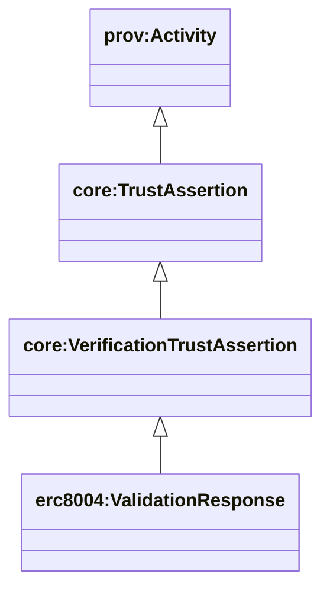
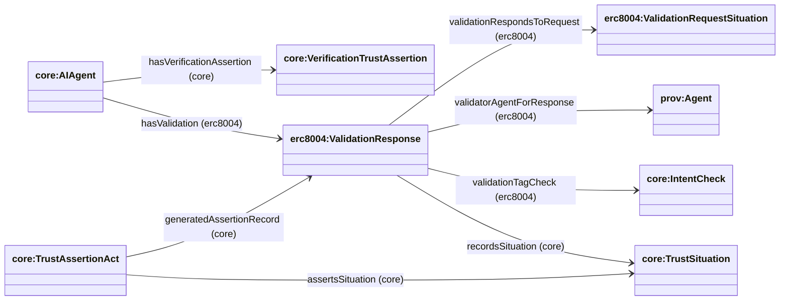

## VerificationTrustAssertion

This page documents the **VerificationTrustAssertion** class hierarchy and property relationships used to represent agent validation and verification claims.

### Class Hierarchy



**Inheritance chain:**
- `prov:Entity` (base PROV-O class)
  - `core:TrustAssertion` (durable trust claim)
    - `core:VerificationTrustAssertion` (verification/validation claim)
      - `erc8004:ValidationResponse` (ERC-8004 validation response)

### Property Relationships



### Core Properties

#### Agent → Assertion Links

- **`core:hasVerificationAssertion`** (domain: `prov:Agent`, range: `core:VerificationTrustAssertion`)
  - Links an agent to verification assertions about it or produced by it
  - Subproperty of `core:hasTrustAssertion`

- **`erc8004:hasValidation`** (domain: `core:AIAgent`, range: `erc8004:ValidationResponse`)
  - ERC-8004 specific property linking agents to validation responses
  - Subproperty of `core:hasVerificationAssertion`

#### Assertion → Request Links

- **`erc8004:validationRespondsToRequest`** (domain: `erc8004:ValidationResponse`, range: `core:VerificationRequestSituation`)
  - Links a validation response to the request it responds to

- **`core:recordsSituation`** (domain: `core:AttestedAssertion`, range: `core:Situation`)
  - Links a durable assertion record (validation response) to the situation it is a record about

- **`core:assertsSituation`** (domain: `core:AssertionAct`, range: `core:Situation`)
  - Links an asserting act to the situation it asserts/validates

#### Validator Links

- **`erc8004:validatorAgentForResponse`** (domain: `erc8004:ValidationResponse`, range: `core:AIAgent`)
  - Optional link when validator address maps to a known AIAgent

#### Validation Check Links

- **`erc8004:validationTagCheck`** (domain: `erc8004:ValidationResponse`, range: `core:IntentCheck`)
  - Links validation response to the intent check/tag being validated

### Datatype Properties

**ValidationResponse properties:**
- `erc8004:validationChainIdForResponse` (xsd:integer) - Chain ID
- `erc8004:requestingAgentIdForResponse` (xsd:string) - Agent ID being validated
- `erc8004:validationResponseValue` (xsd:integer) - Validation score/value
- `erc8004:responseHash` (xsd:string) - Response hash

### Usage Pattern

**Query all verification assertions for an agent:**
```sparql
PREFIX core: <https://core.io/ontology/core#>
PREFIX erc8004: <https://core.io/ontology/erc8004#>

SELECT ?agent ?agentId ?verificationAssertion ?validationValue
WHERE {
  ?agent a core:AIAgent ;
    core:hasVerificationAssertion ?verificationAssertion .
  
  ?verificationAssertion a core:VerificationTrustAssertion .
  
  OPTIONAL {
    ?agent core:agentId ?agentId .
  }
  OPTIONAL {
    ?verificationAssertion erc8004:validationResponseValue ?validationValue .
  }
}
```

**Query validation responses with their requests:**
```sparql
PREFIX erc8004: <https://core.io/ontology/erc8004#>

SELECT ?validationResponse ?validationRequest ?validatorAgent
WHERE {
  ?validationResponse a erc8004:ValidationResponse ;
    erc8004:validationRespondsToRequest ?validationRequest .
  
  OPTIONAL {
    ?validationResponse erc8004:validatorAgentForResponse ?validatorAgent .
  }
}
```

### Related Concepts

- **TrustSituation**: Validation requests are `core:VerificationRequestSituation` (subclass of `core:RequestSituation`, and a `core:VerificationTrustSituation`)
- **TrustAssertion**: VerificationAssertion is a subclass of TrustAssertion
- **IntentCheck**: Validation responses link to intent checks via `validationTagCheck`
- See also: [ERC-8004 documentation](./erc8004.md), [Situation](./situation.md)

